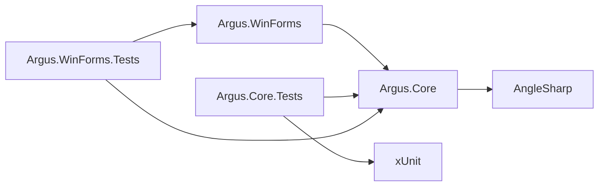
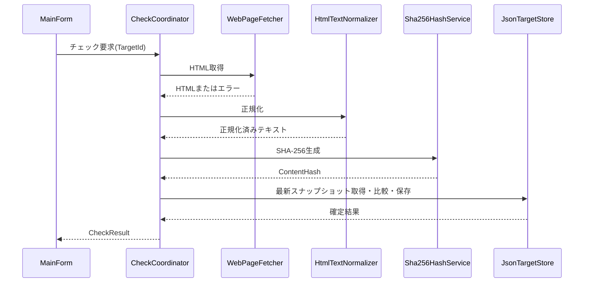
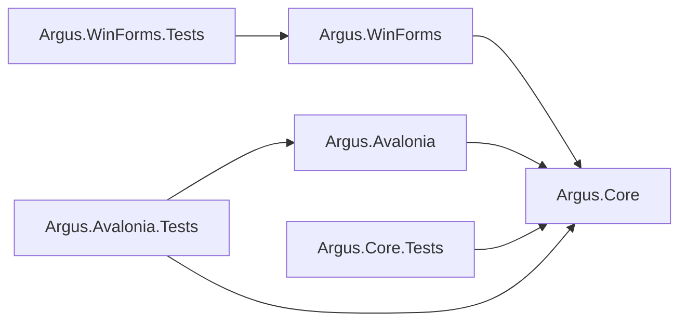

# Argus 基本設計書（ドラフト）

## 1. 文書情報

- 文書名: Argus 基本設計書
- ステータス: 承認済み
- 対象: 初期 MVP、Avalonia UI PoC
- 対応要件: `Design/requirement.md`
- 作成日: 2026-07-22
- 最終更新日: 2026-08-11

本書は、Argus 初期 MVP の実装方式と、初期 MVP 完了後に実施する Avalonia UI PoC の設計を定義します。要件定義書に残っている未確定事項については、実装可能な設計案を示し、ユーザーの確認が必要なものを「要決定事項」としてまとめます。

---

## 2. 設計目標

初期 MVP では、次を重視します。

- WinForms の画面処理と更新チェックロジックを分離する
- HTML 取得、正規化、比較、保存を独立してテストできるようにする
- 実際の Web サイトへ接続せずに主要処理を自動テストできるようにする
- チェックの重複実行を許可しながら、画面表示と保存データの整合性を守る
- エラー時に前回の正常な比較データを破壊しない
- 初期 MVP に不要な機能や抽象化を増やさない
- 将来 UI を変更する場合に Core のロジックを再利用できるようにする

---

## 3. システム構成

### 3.1 プロジェクト構成

現在の単一 WinForms プロジェクトを、次の3プロジェクトへ再構成します。

```text
Argus/
  Argus.sln
  README.md
  AGENTS.md

  Design/
    project-overview.md
    requirement.md
    design.md
    tasks.md

  Argus.WinForms/
    Argus.WinForms.csproj
    Program.cs
    Forms/
      MainForm.cs
      MainForm.Designer.cs
      TargetEditForm.cs
      TargetEditForm.Designer.cs
    Presentation/
      WatchTargetRowViewModel.cs
      ApplicationInfoProvider.cs
      SummerPalette.cs
      CheckStatusAppearance.cs
    Services/
      BrowserService.cs

  Argus.Core/
    Argus.Core.csproj
    Models/
      WatchTarget.cs
      WatchSnapshot.cs
      CheckResult.cs
      WatchMode.cs
      CheckStatus.cs
      TargetStoreDocument.cs
    Abstractions/
      IWebPageFetcher.cs
      IContentNormalizer.cs
      IHashService.cs
      ITargetStore.cs
    Services/
      WebPageFetcher.cs
      HtmlTextNormalizer.cs
      Sha256HashService.cs
      JsonTargetStore.cs
      WatchTargetRepository.cs
      WatchTargetManagementService.cs
      WatchCheckService.cs
      CheckCoordinator.cs

  Argus.Core.Tests/
    Argus.Core.Tests.csproj
    Services/
      WebPageFetcherTests.cs
      HtmlTextNormalizerTests.cs
      WatchCheckServiceTests.cs
      JsonTargetStoreTests.cs
      WatchTargetManagementServiceTests.cs
      CheckCoordinatorTests.cs
    TestDoubles/
    TestData/
```

プロジェクトの対象フレームワークは次のとおりです。

| プロジェクト | SDK | Target Framework | 役割 |
| --- | --- | --- | --- |
| `Argus.WinForms` | `Microsoft.NET.Sdk` | `net8.0-windows` | Windows UI とOS固有処理 |
| `Argus.Core` | `Microsoft.NET.Sdk` | `net8.0` | モデル、チェック処理、HTML処理、JSON永続化 |
| `Argus.Core.Tests` | `Microsoft.NET.Sdk` | `net8.0` | Core の自動テスト |
| `Argus.WinForms.Tests` | `Microsoft.NET.Sdk` | `net8.0-windows` | UI非依存の表示変換とViewModelの自動テスト |

### 3.2 依存方向



依存ルール:

- `Argus.Core` は `Argus.WinForms` を参照しない
- `Argus.WinForms` は `Argus.Core` を参照する
- `Argus.Core.Tests` は `Argus.Core` を参照する
- `Argus.WinForms.Tests` は `Argus.WinForms` と `Argus.Core` を参照し、フォーム操作ではなく表示変換とViewModelを検証する
- Core から `Form`、`Control`、`MessageBox` などの WinForms API を使用しない
- OSの既定ブラウザを開く処理は `Argus.WinForms` に置く

### 3.3 外部ライブラリ

| ライブラリ | バージョン | 使用箇所 | 採用理由 |
| --- | --- | --- | --- |
| AngleSharp | `1.5.2` | `Argus.Core` | HTMLをDOMとして解析し、不正なHTMLにも一定の補正を行いながら要素除去とテキスト抽出を行うため |
| System.Text.Encoding.CodePages | `10.0.10` | `Argus.Core` | Shift_JIS、EUC-JPなど.NET標準で無効なコードページを明示的に有効化するため |
| xUnit | `2.5.3` | `Argus.Core.Tests`、`Argus.WinForms.Tests` | .NET向けの単体テストフレームワークとして使用するため |

依存パッケージは実装開始時に.NET 8との互換性を確認した上で上記バージョンへ固定し、`csproj` で管理します。

モックライブラリは初期段階では追加せず、手書きのスタブまたはフェイクで十分かを先に検証します。

---

## 4. コンポーネント設計

### 4.1 責務一覧

| コンポーネント | 責務 | 主な対応要件 |
| --- | --- | --- |
| `MainForm` | 一覧表示、選択、ユーザー操作受付、結果反映、コピーライト・バージョン・ビルド種別の表示 | FR-001, FR-003, FR-004, FR-008, FR-011, FR-012, FR-013 |
| `TargetEditForm` | 監視対象の追加・編集入力、比較モード固有項目、入力エラー表示 | FR-012, FR-014, FR-015 |
| `ApplicationInfoProvider` | エントリアセンブリからコピーライトと表示用バージョンを取得する | FR-013 |
| `BrowserService` | Windowsの既定ブラウザでURLを開く | FR-011 |
| `CheckCoordinator` | 全件・選択チェックの受付、並行実行、結果コミットの調停 | FR-004, FR-008, FR-009, FR-010 |
| `WatchTargetManagementService` | 監視対象の検証、追加、編集、削除 | FR-012 |
| `WatchTargetRepository` | メモリ上の監視対象管理と変更処理の直列化 | FR-002, FR-009, FR-010, FR-012 |
| `WatchCheckService` | 1件のHTML取得、モード別抽出、比較、結果生成 | FR-005, FR-006, FR-007, FR-014, FR-015 |
| `WebPageFetcher` | HTTP/HTTPSページの取得 | FR-005 |
| `ComparisonContentExtractor` | 監視モードに応じた比較文字列の選択と抽出 | FR-006, FR-014, FR-015 |
| `HtmlTextNormalizer` | HTML解析、不要要素除去、テキスト正規化 | FR-006 |
| `Sha256HashService` | 正規化済みテキストの比較用ハッシュ生成 | FR-007 |
| `JsonTargetStore` | JSONの読み込みと安全な保存 | FR-002, FR-009, FR-010 |

### 4.2 Core の公開インターフェース案

```csharp
public interface IWebPageFetcher
{
    Task<string> FetchAsync(Uri uri, CancellationToken cancellationToken);
}

public interface IContentNormalizer
{
    string Normalize(string html);
}

public interface IComparisonContentExtractor
{
    string Extract(WatchTarget target, string html);
}

public interface IHashService
{
    string Compute(string content);
}

public interface ITargetStore
{
    Task<TargetStoreDocument> LoadAsync(CancellationToken cancellationToken);
    Task SaveAsync(TargetStoreDocument document, CancellationToken cancellationToken);
}
```

インターフェースは、HTTPやファイルシステムへ依存する処理をテスト時に差し替えるために使用します。具象クラスが一つしかなく、差し替えの必要もない処理には、形式的なインターフェースを追加しません。

---

## 5. ドメインモデル

### 5.1 `WatchTarget`

監視対象と、直前に正常終了したチェックの比較情報を保持します。

| プロパティ | 型 | 必須 | 説明 |
| --- | --- | --- | --- |
| `Id` | `Guid` | 必須 | 監視対象を一意に識別するID |
| `Name` | `string` | 必須 | 一覧表示用の名前 |
| `Url` | `Uri` | 必須 | 取得対象となる絶対HTTP/HTTPS URL |
| `Mode` | `WatchMode` | 必須 | `HtmlText`、`HtmlWhole`、`CssSelector` |
| `CssSelector` | `string?` | 条件付き必須 | `CssSelector` モードの場合のみ必須 |
| `IsEnabled` | `bool` | 必須 | チェック対象へ含めるか |
| `Memo` | `string?` | 任意 | ユーザー向けメモ |
| `PreviousSnapshot` | `WatchSnapshot?` | 任意 | 直前に正常終了した比較データ |

制約:

- `Id` はJSON内で重複してはならない
- `Name` は空文字または空白だけを許可しない
- `Url` は絶対URLとし、スキームは `http` または `https` のみ許可する
- `Mode` は `HtmlText`、`HtmlWhole`、`CssSelector` のみ許可する

CSSセレクタは省略可能な `cssSelector` としてスキーマバージョン1へ追加します。既存データでは省略されるため後方互換性を維持します。サイト種別はスキーマに含めません。

### 5.2 `WatchSnapshot`

直前に正常終了したチェックの比較情報を保持します。

| プロパティ | 型 | 説明 |
| --- | --- | --- |
| `ContentHash` | `string` | 正規化済みテキストから生成したSHA-256ハッシュ |
| `CheckedAtUtc` | `DateTimeOffset` | 正常チェックの完了日時（UTC） |

初期 MVP ではJSONの肥大化を避けるため、正規化済み本文そのものは保存せず、SHA-256ハッシュのみ保存します。将来の差分表示では別途本文保存方式とデータ移行を設計します。

### 5.3 `CheckStatus`

```csharp
public enum CheckStatus
{
    Unchecked,
    FirstFetch,
    Unchanged,
    Updated,
    Error
}
```

`Unchecked` は起動中にまだチェックしていない表示状態です。保存済みスナップショットが存在しても、起動直後の画面状態は `Unchecked` とします。

### 5.4 `CheckResult`

1回のチェック結果を表す不変オブジェクトとします。

| プロパティ | 型 | 説明 |
| --- | --- | --- |
| `OperationId` | `Guid` | チェック実行を識別するID |
| `TargetId` | `Guid` | 対象ID |
| `Status` | `CheckStatus` | 判定結果 |
| `CompletedAtUtc` | `DateTimeOffset` | 結果確定日時 |
| `ContentHash` | `string?` | 正常時の比較用ハッシュ |
| `ErrorMessage` | `string?` | ユーザー表示用エラー概要 |

例外オブジェクトやスタックトレースはJSONへ保存せず、UIへ渡す結果にも直接公開しません。

### 5.5 `WatchMode`

```csharp
public enum WatchMode
{
    HtmlText,
    HtmlWhole,
    CssSelector
}
```

将来のモードは、対応要件が追加された時点で列挙値と実装を追加します。

---

## 6. JSONデータ設計

### 6.1 保存先

```text
%APPDATA%\Argus\targets.json
```

保存先の解決には `Environment.GetFolderPath(Environment.SpecialFolder.ApplicationData)` を使用します。

### 6.2 JSONスキーマ

ルートにスキーマバージョンを持たせます。

```json
{
  "schemaVersion": 1,
  "targets": [
    {
      "id": "7c67615f-dac0-44fb-9be0-7de2afca3c30",
      "name": "サンプルページ",
      "url": "https://example.com/",
      "mode": "htmlText",
      "isEnabled": true,
      "memo": null,
      "previousSnapshot": {
        "contentHash": "SHA-256_HASH_HEX",
        "checkedAtUtc": "2026-07-22T00:00:00+00:00"
      }
    }
  ]
}
```

シリアライズ方針:

- `System.Text.Json` を使用する
- UTF-8、BOMなしで保存する
- プロパティ名は `camelCase` とする
- 列挙値は可読性のため文字列で保存する
- 日時は UTC のISO 8601形式で保存する
- 読み込み時のプロパティ名は大文字・小文字を区別しない
- 未知のプロパティは無視し、将来の項目追加へ備える
- `schemaVersion` が未対応の場合は読み込みエラーとする

### 6.3 ファイル状態ごとの動作

| 状態 | 動作 |
| --- | --- |
| ファイルが存在しない | 保存先ディレクトリと空の `schemaVersion: 1` 文書を作成し、0件で起動する |
| 空ファイル | 起動時エラーを表示し、ファイルを上書きせず、主要操作を無効化する |
| JSON構文が不正 | 起動時エラーを表示し、ファイルを上書きせず、主要操作を無効化する |
| 必須項目が不正 | 対象を特定できる起動時エラーを表示し、ファイルを上書きせず、主要操作を無効化する |
| スキーマバージョンが未対応 | 起動時エラーを表示し、ファイルを上書きせず、主要操作を無効化する |

監視対象はアプリの追加・編集画面から登録します。ファイルが存在しない初回起動時は0件の一覧を表示し、ユーザーが「追加」操作から最初の監視対象を登録します。`targets.json` の手動編集は通常の利用手順としません。

### 6.4 安全な保存

保存は次の順で行います。

1. 現在のデータから新しい `TargetStoreDocument` を生成する
2. 同じディレクトリの一時ファイルへJSONを書き込む
3. 書き込み完了後、一時ファイルを `targets.json` へ置換する
4. 置換成功後に、メモリ上の現在データを更新する
5. 失敗した場合は一時ファイルを可能な範囲で削除し、既存の `targets.json` とメモリ上の前回データを維持する

同一プロセス内の保存処理は `SemaphoreSlim` で直列化し、複数チェックによる同時書き込みを防ぎます。

`WatchTargetRepository` はチェック結果のコミットと監視対象の追加・編集・削除を同じロックで直列化します。ファイル保存が成功した後にだけメモリ上のデータとUIへ変更を通知します。

---

## 7. チェック処理設計

### 7.1 1件のチェックフロー



処理手順:

1. `CheckCoordinator` が対象IDと `OperationId` を採番する
2. 対象が存在し、有効であることを確認する
3. `WebPageFetcher` がHTMLを非同期取得する
4. `HtmlTextNormalizer` がHTMLを正規化する
5. `Sha256HashService` が正規化済みテキストのハッシュを生成する
6. コミット用ロックを取得する
7. コミット時点の最新 `PreviousSnapshot` と今回のハッシュを比較する
8. 初回取得、更新なし、更新ありのいずれかを決定する
9. 正常結果をJSONへ保存する
10. 保存成功後にロックを解放し、確定結果をUIへ通知する

取得、正規化、ハッシュ生成のいずれかに失敗した場合は、保存を行わず `Error` をUIへ通知します。

### 7.2 状態判定

| 条件 | 結果 |
| --- | --- |
| `PreviousSnapshot` が存在しない | `FirstFetch` |
| 前回ハッシュと今回ハッシュが同一 | `Unchanged` |
| 前回ハッシュと今回ハッシュが異なる | `Updated` |
| 取得、正規化、比較、保存に失敗 | `Error` |

正常に取得できた場合は、`FirstFetch`、`Unchanged`、`Updated` のいずれでも今回のハッシュと完了日時を新しいスナップショットとして保存します。

### 7.3 全件チェックと選択項目チェック

- 全件チェックは、読み込み済みの `IsEnabled == true` の対象をすべて要求キューへ追加する
- 選択項目チェックは、画面で選択された対象のうち `IsEnabled == true` のものを要求キューへ追加する
- 選択がない状態で選択項目チェックを押した場合は処理せず、ユーザーへ案内する
- 無効な対象は一覧へ表示するが、どちらのチェックでも実行しない
- チェックボタンはチェック中も有効に保つ

### 7.4 並行実行と重複チェック

チェック要求は実行中でも受け付けます。同じ監視対象への要求も拒否しません。

リソース消費を制御するため、HTTP取得の同時実行数はアプリ全体で最大4件とし、それを超える要求はメモリ上のキューで待機させます。初期 MVP ではこの値を固定し、設定UIは設けません。

結果確定には次のルールを適用します。

1. HTML取得と正規化は並行して実行できる
2. 比較、JSON保存、画面へ通知する結果の確定はコミット用ロック内で直列化する
3. ロックを取得した時点の最新スナップショットと比較する
4. コミットが最後に完了した結果を、画面上の最終結果とする
5. 最後の処理がエラーの場合、画面は `Error` とするが、正常なスナップショットは変更しない

これにより、処理開始順やHTTP応答順に依存せず、正常にコミットされた順序で前回データを更新できます。

### 7.5 キャンセル

Core の非同期APIは `CancellationToken` を受け取れる設計とします。ただし、初期 MVP のUIにはキャンセルボタンを設けません。

アプリ終了時はアプリケーション全体の `CancellationTokenSource` を即時キャンセルし、実行中およびキュー待機中のチェック完了を待たずに画面を閉じます。キャンセル後に完了した非同期処理は、破棄済みの画面へ結果を通知しません。

保存処理がキャンセルされた場合も、一時ファイル方式によって既存の `targets.json` を維持します。残った一時ファイルは次回起動時に削除対象とします。

---

## 8. Webページ取得設計

### 8.1 `HttpClient` の管理

- アプリケーションの起動中は共有する単一の `HttpClient` を使用する
- 各チェックで `HttpClient` を生成、破棄しない
- `WebPageFetcher` へコンストラクター注入する
- HTTPリダイレクトは許可する
- タイムアウトは30秒とする
- HTTP成功ステータス以外は例外として扱う

### 8.2 URL制約

- 絶対URLのみ許可する
- `http` と `https` のみ許可する
- `file`、`ftp`、独自スキームは許可しない
- ブラウザで開く際にも同じ検証済みURLを使用する

### 8.3 文字コード

次の優先順位でHTMLを文字列化します。

1. HTTP `Content-Type` の `charset`
2. BOM
3. HTML内の `meta charset` または同等の `http-equiv` 指定
4. UTF-8

HTTPヘッダーとBOMで文字コードを確定できない場合は、取得したバイト列の先頭部分からASCII互換の `meta charset` または `http-equiv="Content-Type"` のcharset指定を探索します。

不正なcharset指定、未対応の文字コード、またはデコード不能時は取得エラーとします。文字コード判定は、UTF-8、Shift_JIS、EUC-JPなどの固定テストデータを使って検証します。

### 8.4 User-Agent

Argusであることとバージョンを識別できる固定の User-Agent を送信します。連絡先URLなどは初期 MVP では含めません。

```text
Argus/0.1
```

---

## 9. HTMLテキスト正規化設計

### 9.1 処理順序

1. AngleSharpでHTMLをDOMへ解析する
2. `script` 要素をDOMから削除する
3. `style` 要素をDOMから削除する
4. コメントノードをDOMから削除する
5. 文書全体のテキスト内容を取得する
6. HTMLエンティティはDOM解析結果の文字として扱う
7. Unicode上の連続する空白文字を半角スペース1文字へ置換する
8. 先頭と末尾の空白を除去する

正規化では、大文字・小文字、句読点、Unicode正規化形式などを変更しません。本文の意味を変える可能性がある変換は行いません。

### 9.2 比較例

次の二つは同一内容として扱います。

```html
<p>今日は 更新です</p>
```

```html
<p>
  今日は   更新です
</p>
<script>dynamicValue = 123;</script>
```

次は本文テキストが異なるため、更新として扱います。

```html
<p>今日は更新です</p>
```

```html
<p>明日は更新です</p>
```

### 9.3 ハッシュ

- アルゴリズムはSHA-256を使用する
- 正規化済み文字列をUTF-8へ変換してハッシュ化する
- JSONには小文字の16進文字列として保存する
- ハッシュ比較には序数比較を使用する

### 9.4 HTML全体比較

- `HtmlWhole` では取得・文字コード変換後のHTML文字列を加工せずハッシュ化する
- 要素、属性、コメント、空白、改行を含む文字列上の差を更新として扱う

### 9.5 CSSセレクタ比較

1. AngleSharpでHTMLをDOMへ解析する
2. 保存済みのCSSセレクタを `QuerySelectorAll` へ渡す
3. 一致する全要素の `OuterHtml` を文書順に改行文字1文字で連結する
4. セレクタ未指定、不正、または一致件数0の場合は `InvalidDataException` とする
5. 抽出文字列をSHA-256でハッシュ化する

CSSセレクタ自体は入力時に前後空白を除去して保存します。モード、URL、CSSセレクタのいずれかが変わった場合は比較条件が変化するため、前回スナップショットを破棄します。

---

## 10. UI設計

### 10.0 HTML UIモックによる事前確認

WinForms実装前に、画面構成と夏テーマの視認性を確認するための静的UIモックを `UI/` に作成します。

- `UI/index.html` をVS CodeのLive Serverで開き、メイン画面、追加・編集ダイアログ、削除確認、入力・操作エラーを確認する
- HTML、CSS、Vanilla JavaScriptだけを使用し、外部パッケージや実際のWebサイトへのアクセスは行わない
- 初期表示はWinFormsのクライアント領域 `1100 x 700` を想定する
- `Button`、`DataGridView`、`StatusStrip`、モーダルダイアログなど、WinFormsの標準コントロールで再現できる表現を使用する
- グラデーション、複雑なアニメーション、独自ウィンドウ枠など、WinFormsへ直接移植しにくい表現は使用しない
- 色は10.8のカラーパレットをCSS変数へ集約し、将来の `SummerPalette` と対応させる
- 状態、選択、無効、入力エラー、フォーカスを色だけに依存せず文字や枠線でも示す
- HTMLモックは設計確認用成果物として残すが、WinFormsアプリの実行時には読み込まない
- HTMLモックの承認後に `MainForm` と `TargetEditForm` のWinForms実装へ進む

### 10.1 メイン画面

初期 MVP は一覧を表示する `MainForm` と、追加・編集に使用するモーダルな `TargetEditForm` で構成します。

画面要素:

| 要素 | 種別 | 動作 |
| --- | --- | --- |
| 全件チェック | Button | 有効な全監視対象をキューへ追加する |
| 選択をチェック | Button | 選択された有効な監視対象をキューへ追加する |
| ブラウザで開く | Button | 選択された1件のURLを既定ブラウザで開く |
| 追加 | Button | `TargetEditForm` を新規追加モードで開く |
| 編集 | Button | 選択された1件を `TargetEditForm` で編集する |
| 削除 | Button | 選択された1件を確認後に削除する |
| 監視対象一覧 | DataGridView | 複数選択可能な読み取り専用一覧 |
| メッセージ領域 | StatusStrip | 起動エラー、選択不足、実行件数、ビルド情報などを表示する |

一覧列:

| 列 | 内容 |
| --- | --- |
| 有効 | `IsEnabled` |
| 名前 | `Name` |
| URL | `Url` |
| 状態 | 現在の `CheckStatus` |
| 最終チェック | 最後に画面へ反映された結果の完了日時 |
| エラー | `Error` 時の概要 |

初期表示順はJSONの配列順とし、並べ替えや絞り込み機能は設けません。無効な対象も一覧へ表示し、視覚的に無効であることを示します。

### 10.2 UI状態管理

`MainForm` は Core のモデルを直接編集せず、`WatchTargetRowViewModel` を一覧へバインドします。

行ごとに次を画面状態として保持します。

- 対象ID
- 表示用の名前とURL
- 有効状態
- 最後に確定したチェック状態
- 最終チェック日時
- エラー概要
- 実行中のチェック数

同じ対象を複数回チェックできるため、単純な `IsChecking` ではなく実行数を保持します。実行数が1以上の場合は、最終結果を保持したままチェック中であることを補助表示します。

### 10.3 監視対象の追加・編集画面

`TargetEditForm` は追加と編集で共用します。

| 項目 | コントロール | 入力規則 |
| --- | --- | --- |
| 名前 | TextBox | 必須。前後の空白を除去後、1文字以上 |
| URL | TextBox | 必須。絶対HTTP/HTTPS URL |
| 監視モード | ComboBox | 必須。HTMLテキスト、HTML全体、CSSセレクタから選択 |
| CSSセレクタ | TextBox | CSSセレクタ比較の場合のみ表示して必須 |
| 有効 | CheckBox | 新規追加時の初期値は有効 |
| メモ | 複数行TextBox | 任意 |

保存時に全項目を検証し、不正な項目の近くへエラーを表示します。入力エラーがある場合は画面を閉じません。

追加時:

- `Id` はアプリが新しい `Guid` を生成する
- `PreviousSnapshot` は `null` とする
- JSON保存成功後に一覧へ追加する

編集時:

- `Id` は変更しない
- 名前、有効状態、メモだけを変更した場合は `PreviousSnapshot` を維持する
- URLまたは監視モードを変更した場合は `PreviousSnapshot` を破棄する
- JSON保存成功後に一覧へ変更を反映する
- 保存に失敗した場合はフォームを閉じず、一覧と保存済みデータを変更しない

### 10.4 削除

- 一覧で1件選択されている場合だけ削除できる
- 対象名を含む確認ダイアログを表示する
- ユーザーが確認した場合だけ削除する
- JSON保存成功後に一覧から削除する
- 保存に失敗した場合は一覧と保存済みデータを変更しない
- 削除した対象のスナップショットも同時に削除する

### 10.5 チェック中の編集競合

- 実行中チェック数が1以上の対象は編集・削除ボタンの対象にできない
- チェック中ではない別の対象は編集・削除できる
- 新規追加はチェック処理中も許可する
- 全件チェックは、操作を受け付けた時点で存在する有効な対象を対象とする
- 追加後の対象は、実行中の全件チェックへ途中参加させない

### 10.6 非同期処理

- UIイベントハンドラーは `async` とし、ネットワーク処理でUIスレッドをブロックしない
- Coreから返された結果のUI反映はUIスレッドで行う
- チェック中も一覧の選択、ブラウザ起動、新しいチェック操作を許可する
- 未処理例外でアプリを終了させず、ユーザー向けメッセージへ変換する

### 10.7 ブラウザ起動

`BrowserService` は検証済みURLを `ProcessStartInfo.UseShellExecute = true` で起動します。

- 選択が0件の場合は案内を表示する
- 複数選択時は先頭の1件を開くのではなく、1件選択を求める
- 起動に失敗した場合はエラーを表示し、アプリを継続する

### 10.8 「夏」テーマの配色

青空、海、水、白い雲、夏の日差しをモチーフにした、明るいライトテーマを使用します。装飾を増やしすぎず、業務用デスクトップアプリとしての視認性を優先します。

#### 基本カラーパレット

| トークン | HEX | イメージ | 用途 |
| --- | --- | --- | --- |
| `Background` | `#F4FAFD` | 薄い夏空 | フォーム全体の背景 |
| `Surface` | `#FFFFFF` | 白い雲 | 一覧、入力領域、ダイアログ背景 |
| `Primary` | `#0277BD` | 青空と海 | 主要ボタン、見出し、選択強調 |
| `PrimaryHover` | `#01579B` | 深い海 | 主要ボタンのホバー・押下 |
| `Accent` | `#00ACC1` | 水面 | 実行中表示、補助的な強調 |
| `Sun` | `#F9A825` | 夏の日差し | 更新あり、注意表示のアクセント |
| `Leaf` | `#2E7D32` | 夏の緑 | 更新なし、正常表示 |
| `TextPrimary` | `#17324D` | 濃紺 | 本文、表の主要文字 |
| `TextSecondary` | `#526D7A` | 青みの灰色 | 補足、日時、メモ |
| `Border` | `#B8D8E8` | 水色 | 枠線、区切り線 |
| `Selection` | `#B3E5FC` | 浅瀬 | 一覧の選択行 |
| `SelectionText` | `#102A43` | 濃紺 | 選択行の文字 |
| `DisabledBackground` | `#E8F1F5` | 薄い曇り空 | 無効コントロール背景 |
| `DisabledText` | `#718792` | 灰青 | 無効コントロール文字 |
| `Danger` | `#C62828` | 警告赤 | エラー、削除操作 |
| `Focus` | `#00695C` | 深い青緑 | キーボードフォーカス枠 |

#### コントロールへの適用

| 対象 | 背景 | 文字・前景 | 補足 |
| --- | --- | --- | --- |
| フォーム | `Background` | `TextPrimary` | メイン・編集画面で共通 |
| 一覧・入力領域 | `Surface` | `TextPrimary` | `Border` で区切る |
| 主要ボタン | `Primary` | `#FFFFFF` | 全件チェック、選択チェック、保存 |
| 主要ボタンのホバー・押下 | `PrimaryHover` | `#FFFFFF` | マウス操作を明示 |
| 補助ボタン | `Surface` | `Primary` | `Primary` の枠線を付ける |
| 削除ボタン | `Surface` | `Danger` | `Danger` の枠線を付け、赤一色の面積を抑える |
| 無効コントロール | `DisabledBackground` | `DisabledText` | 操作不可であることを明示 |
| DataGridViewヘッダー | `#D9F0FA` | `TextPrimary` | 太字を使用する |
| DataGridView偶数行 | `Surface` | `TextPrimary` | － |
| DataGridView奇数行 | `#F7FCFE` | `TextPrimary` | 薄い交互色 |
| DataGridView選択行 | `Selection` | `SelectionText` | 非選択行と明確に区別 |
| StatusStrip | `#D9F0FA` | `TextPrimary` | 実行件数や案内を表示 |
| フォーカス枠 | `Surface` | `Focus` | 色に加えて枠線で示す |

#### チェック状態の配色

状態は色だけで判断させず、一覧の「状態」列に日本語の状態名を必ず表示します。

| 状態 | 背景 | 文字 | 表示名 |
| --- | --- | --- | --- |
| 未確認 | `#ECEFF1` | `#455A64` | 未確認 |
| 初回取得 | `#E3F2FD` | `#0D47A1` | 初回取得 |
| 更新なし | `#E8F5E9` | `#1B5E20` | 更新なし |
| 更新あり | `#FFF3E0` | `#BF360C` | 更新あり |
| エラー | `#FFEBEE` | `#B71C1C` | エラー |
| チェック中 | `#E0F7FA` | `#006064` | チェック中（件数） |

チェック中は保存済みの最終状態を消さず、状態文字または補助表示に「チェック中」と実行数を併記します。

#### 実装方針

- 色値は `Argus.WinForms/Presentation/SummerPalette.cs` に集約する
- フォームごとにHEX値を直接記述しない
- WinFormsの `ColorTranslator.FromHtml` または `Color.FromArgb` で色を生成する
- ボタンは `FlatStyle.Flat` を基本とし、標準的な余白とフォーカス表示を維持する
- 状態色の割り当ては `CheckStatusAppearance` へ集約する
- Windowsのフォント拡大やDPI変更時にも文字が欠けないレイアウトにする
- 色だけで状態、エラー、選択、操作可否を伝えない
- Windowsのハイコントラストモードが有効な場合は、テーマ色の強制適用を避け、システム色を優先する

### 10.9 コピーライト、バージョン、デバッグ表示

メイン画面下部の `StatusStrip` 右端へ、コピーライト、バージョン番号、ビルド種別を表示します。

左から右への配置順:

1. 通常メッセージ用 `ToolStripStatusLabel`。`Spring = true` として残り幅を使用する
2. コピーライト表示用 `ToolStripStatusLabel`
3. デバッグ表示用 `ToolStripStatusLabel`
4. バージョン表示用 `ToolStripStatusLabel`

#### コピーライト表示

- 表示文字列は `Copyright © 2026 SIA-ACT` とする
- `Argus.WinForms.csproj` の `Copyright` を情報源とする
- 実行時はエントリアセンブリの `AssemblyCopyrightAttribute` から取得する
- コピーライト文字列をフォームへハードコードしない
- コピーライトを取得できない場合は該当ラベルを非表示にし、アプリの起動は継続する
- 表示色は `TextSecondary` とし、通常メッセージやバージョンより控えめに表示する

#### バージョン表示

- 表示形式は `v{major}.{minor}.{patch}` とする
- 初期 MVP の開始バージョンは `v0.1.0` とする
- `Argus.WinForms.csproj` の `VersionPrefix` をバージョンの情報源とする
- 実行時はエントリアセンブリの `AssemblyInformationalVersionAttribute` から取得する
- `+` 以降のビルドメタデータがある場合は画面表示から除外する
- Informational Versionを取得できない場合だけ `AssemblyName.Version` へフォールバックする
- フォールバックにも失敗した場合は `vUnknown` と表示し、アプリの起動は継続する
- バージョン文字列をフォームへハードコードしない

プロジェクト設定:

```xml
<PropertyGroup>
  <VersionPrefix>0.1.0</VersionPrefix>
  <Copyright>Copyright © 2026 SIA-ACT</Copyright>
</PropertyGroup>
```

#### デバッグ表示

- Debug構成では `DEBUG` と表示する
- Release構成ではラベルを非表示にし、空白領域も確保しない
- 表示の切り替えには `#if DEBUG` を使用する
- `DEBUG` の背景は更新ありと同じ `#FFF3E0`、文字色は `#BF360C` とする
- 色だけに依存せず、必ず `DEBUG` の文字を表示する
- デバッグ表示は診断情報の展開機能ではなく、ビルド種別を識別するためだけに使用する

初期 MVP ではブランチ名、コミットID、ビルド日時などの追加情報は表示しません。

---

## 11. エラー処理

### 11.1 エラー分類

| 分類 | 例 | UI動作 | 前回データ |
| --- | --- | --- | --- |
| 起動データエラー | JSON不正、未対応スキーマ | メッセージ領域とダイアログへ表示 | 上書きしない |
| 入力エラー | URL不正、ID重複 | 対象を特定して表示 | 上書きしない |
| 通信エラー | タイムアウト、DNS、非成功HTTP | 対象行を `Error` にする | 上書きしない |
| 解析エラー | HTML解析失敗 | 対象行を `Error` にする | 上書きしない |
| 保存エラー | 権限、容量不足、ファイル競合 | 対象行を `Error` にする | 上書きしない |
| ブラウザ起動エラー | 関連付けなし、OSエラー | メッセージを表示 | 変更しない |

### 11.2 ユーザー向けエラー

- 対象名と失敗した処理を短く表示する
- URL、HTML本文、スタックトレースを画面へそのまま表示しない
- 一つの対象の失敗で他の対象の処理を中断しない
- エラー結果は画面へ反映するが、永続化された正常スナップショットを削除しない

初期 MVP では永続ログファイルを設けません。開発時の詳細は `Debug.WriteLine` などへ出力できますが、秘密情報やHTML本文を出力しません。

起動データエラー時は一覧を通常状態として扱わず、全件チェック、選択チェック、追加、編集、削除、ブラウザ起動を無効化します。ユーザーがファイルを修正してアプリを再起動するまで主要操作を再開しません。

---

## 12. テスト設計

### 12.1 テスト構成

`Argus.Core.Tests` と `Argus.WinForms.Tests` にxUnitを使用します。テストから実際のWebサイトへアクセスせず、WinFormsの描画やコントロール生成を伴うテストはSTAスレッドで実行します。

| テスト対象 | テスト方法 |
| --- | --- |
| `HtmlTextNormalizer` | 文字列または `TestData` のHTMLを入力する純粋な単体テスト |
| `Sha256HashService` | 固定文字列と既知の期待値を比較する単体テスト |
| `WebPageFetcher` | 応答バイト列とHTTPヘッダーを制御するフェイク `HttpMessageHandler` を使用する単体テスト |
| `WatchCheckService` | `IWebPageFetcher`、`IComparisonContentExtractor`、`IHashService` のスタブを使用する単体テスト |
| `JsonTargetStore` | テストごとの一時ディレクトリを使用するファイル結合テスト |
| `WatchTargetManagementService` | ストアのフェイクを使用する追加・編集・削除の単体テスト |
| `CheckCoordinator` | 完了順序を制御できるフェイクと同期プリミティブを使用する並行処理テスト |
| `WatchTargetRowViewModel`、`CheckStatusAppearance` | 状態名、チェック中件数、表示値、色トークンへの変換を確認する単体テスト |
| `MainForm` | STAスレッド上でフォームを生成し、初期サイズ、一覧列、主要操作、起動エラー時の無効化を確認する構造スモークテスト |

### 12.2 TDDサイクル

実装タスクは、次の単位で Red、Green、Refactor を繰り返します。

1. 対応する要件IDと受け入れ条件を選ぶ
2. 期待する外部動作を表すテストを一つ作る
3. テストが意図した理由で失敗することを確認する
4. テストを成功させる最小限のコードを書く
5. 関連テストをすべて実行する
6. 重複や責務の混在を改善する
7. 全テストが成功することを確認する
8. `Design/tasks.md` の進捗を更新する

### 12.3 必須テストケース

#### HTML正規化（FR-006）

- `script` 内容を除外する
- `style` 内容を除外する
- HTMLコメントを除外する
- HTMLエンティティを文字として扱う
- 連続空白と改行を単一スペースへ正規化する
- 先頭と末尾の空白を除去する
- 本文の変更は保持する
- 不完全なHTMLでも期待するテキストを取得する

#### Webページ取得と文字コード（FR-005）

- HTTP `Content-Type` のcharsetでデコードできる
- BOMから文字コードを判定できる
- `meta charset` から文字コードを判定できる
- `http-equiv` のcharset指定から文字コードを判定できる
- charset指定がない場合はUTF-8としてデコードする
- 不正または未対応のcharsetをエラーにする
- テストでは実際のWebサイトへ接続しない

#### 状態判定（FR-007）

- 前回スナップショットなしなら `FirstFetch`
- ハッシュが同じなら `Unchanged`
- ハッシュが異なるなら `Updated`
- 取得失敗なら `Error`
- 正規化失敗なら `Error`

#### データ保護（FR-009、FR-010）

- 正常結果を保存できる
- 再起動相当の再読み込みでスナップショットを復元できる
- 通信エラー時に前回スナップショットを変更しない
- 解析エラー時に前回スナップショットを変更しない
- 保存失敗時に既存ファイルとメモリ状態を変更しない
- 不正なJSONを上書きしない

#### 重複実行（FR-004）

- チェック中に別のチェック要求を受け付ける
- 同じ対象への重複要求を受け付ける
- HTTP取得の最大同時実行数を超えない
- キュー待機中のチェックをキャンセルできる
- 実行中のチェックへキャンセルを伝播できる
- コミット時点の最新スナップショットと比較する
- 最後にコミットされた正常結果を画面と保存へ反映する
- 最後の結果がエラーなら画面を `Error` にし、正常スナップショットを維持する

#### JSON読み込み（FR-002）

- 正常な複数対象を読み込める
- ファイルが存在しない場合に空文書を作成できる
- 空ファイルをエラーにする
- 不正JSONをエラーにする
- ID重複をエラーにする
- 空の名前をエラーにする
- HTTP/HTTPS以外のURLをエラーにする
- 未対応スキーマバージョンをエラーにする
- 読み込みエラー時に既存JSONを上書きしない

#### 監視対象管理（FR-012）

- 正常な入力で監視対象を追加できる
- 追加時にIDを生成し、前回スナップショットを持たない
- 空の名前を保存できない
- HTTP/HTTPS以外のURLを保存できない
- 編集してもIDを変更しない
- 名前、有効状態、メモだけの編集では前回スナップショットを維持する
- URL変更時に前回スナップショットを破棄する
- 削除時に対象とスナップショットを削除する
- 保存失敗時に追加、編集、削除をメモリへ反映しない
- チェック中の対象を編集または削除できない

### 12.4 UIの検証

初期 MVP では WinForms の自動UIテストを導入しません。UIへ置くロジックを最小化し、Core とViewModel相当の処理を自動テストします。

次は手動確認項目とします。

- アプリが起動し、一覧が表示される
- JSON読み込みエラー時に主要操作が無効化される
- 監視対象を追加、編集、削除できる
- 入力エラーが該当項目の近くへ表示される
- URL変更後のチェックが初回取得になる
- チェック中の対象を編集または削除できない
- 全件チェックと選択項目チェックを操作できる
- チェック中も新しいチェック操作を行える
- 状態とエラーが適切な行へ反映される
- 選択したURLを既定ブラウザで開ける
- アプリ終了時に長時間停止しない
- 終了時にチェック完了を待たず、キャンセル後の結果が画面へ反映されない
- メイン画面と編集画面に夏テーマが一貫して適用される
- 通常、選択、ホバー、フォーカス、無効の状態を視覚的に区別できる
- 各チェック状態に状態名が表示され、色だけに依存していない
- 文字が背景へ埋もれず、一覧と入力内容を判読できる
- Windowsのハイコントラストモードでシステム色が優先される
- Debugビルドでステータスバー右端にコピーライト、`DEBUG`、バージョン番号が表示される
- Releaseビルドでコピーライトとバージョン番号が表示され、`DEBUG` とその空白領域が表示されない
- 表示コピーライトがアセンブリ情報の `Copyright © 2026 SIA-ACT` と一致する
- 表示バージョンがアセンブリ情報と一致する

手動確認項目は `Design/tasks.md` の該当タスクへチェックリストとして記載します。

---

## 13. アプリケーション起動と依存構築

初期 MVP では外部DIコンテナーを追加せず、`Program.Main` で依存関係を組み立てます。

構築順:

1. アプリケーション保存先を解決する
2. 共有 `HttpClient` を生成する
3. `WebPageFetcher`、`HtmlTextNormalizer`、`Sha256HashService` を生成する
4. `JsonTargetStore` を生成する
5. `WatchTargetRepository` と `WatchTargetManagementService` を生成する
6. `WatchCheckService` と `CheckCoordinator` を生成する
7. `BrowserService` を生成する
8. `MainForm` へ必要な依存を渡して起動する

DIコンテナーは、依存関係が増えて手動構築が保守しにくくなった時点で再検討します。

---

## 14. 配布設計

初期 MVP の開発中は通常のFramework-dependentビルドを使用します。MVP完了時に、Windows x64向けの self-contained single-file executable を生成します。

配布候補コマンド:

```powershell
dotnet publish Argus.WinForms/Argus.WinForms.csproj `
  -c Release `
  -r win-x64 `
  --self-contained true `
  -p:PublishSingleFile=true `
  -p:IncludeNativeLibrariesForSelfExtract=true `
  -p:DebugType=None `
  -p:DebugSymbols=false
```

ネイティブライブラリを実行ファイルへ格納し、配布に不要なPDBを生成しないことで、配布物を単一の実行ファイルにします。single-file化によって動作差異がないことを、リリース確認タスクで手動検証します。

---

## 15. 要件トレーサビリティ

| 要件 | 主な設計箇所 | 主な検証方法 |
| --- | --- | --- |
| FR-001 | 3、10、13 | ビルド、起動確認 |
| FR-002 | 6 | `JsonTargetStoreTests` |
| FR-003 | 10 | 手動UI確認 |
| FR-004 | 7.3、7.4、10 | `CheckCoordinatorTests`、手動UI確認 |
| FR-005 | 7、8 | `WebPageFetcherTests`、`WatchCheckServiceTests` |
| FR-006 | 9 | `HtmlTextNormalizerTests` |
| FR-007 | 5、7.2、9.3 | `WatchCheckServiceTests` |
| FR-008 | 7.4、10 | `CheckCoordinatorTests`、手動UI確認 |
| FR-009 | 6.4、7 | `JsonTargetStoreTests`、`CheckCoordinatorTests` |
| FR-010 | 6.4、7.4、11 | `JsonTargetStoreTests`、`CheckCoordinatorTests` |
| FR-011 | 10.7 | 手動UI確認 |
| FR-012 | 6、10.3～10.5、12 | `WatchTargetManagementServiceTests`、手動UI確認 |
| FR-013 | 10.9、12.4 | Debug/Releaseビルドでのコピーライト・バージョン表示の手動UI確認 |
| FR-016 | 18 | Windowsでの全機能確認、macOSでの代表操作確認 |
| NFR-001 | 3.1 | ビルド、Windows起動確認 |
| NFR-002 | 14 | Release publish、起動確認 |
| NFR-003 | 6 | `JsonTargetStoreTests` |
| NFR-004 | 9 | `HtmlTextNormalizerTests` |
| NFR-005 | 3、4 | 依存関係レビュー、ビルド |
| NFR-006 | 7.3、10 | 手動UI確認 |
| NFR-007 | 12 | `dotnet test` |
| NFR-008 | 10.8、12.4 | 手動UI確認 |
| NFR-009 | 18.3～18.6 | ViewModelテスト、テーマとUIの手動確認 |
| NFR-010 | 18.8 | Visual Studio 2022およびVS Codeでの検証 |

---

## 16. 確定した設計判断

要件定義書の未確定事項に対し、次の方針を採用します。

| 項目 | 確定方針 |
| --- | --- |
| 初期データの登録 | 追加・編集・削除UIを設ける |
| ファイルが存在しない | 空のスキーマ文書を自動作成する |
| 空または不正なJSON | エラー表示し、既存ファイルを上書きしない |
| 必須項目 | ID、名前、URL、監視モード、有効状態 |
| 無効対象 | 一覧には表示し、チェック対象から除外する |
| 更新時の保存 | 正常チェック完了時に直ちに前回データを更新する |
| 比較用データ | 正規化本文は保存せず、SHA-256ハッシュを保存する |
| タイムアウト | 30秒 |
| リダイレクト | 許可する |
| URLスキーム | HTTP/HTTPSのみ許可する |
| 同時取得数 | 最大4件、超過分はキューで待機する |
| User-Agent | `Argus/0.1` |
| 無効対象の表示 | 一覧へ表示し、無効であることを視覚的に示す |
| 最終チェック日時 | 画面表示し、正常スナップショットの日時を保存する |
| 一覧順 | JSONの配列順 |
| テスト | xUnitを使用する |
| HTML解析 | AngleSharpを使用する |
| 配布対象 | Windows x64 |
| HTML文字コード | HTTPヘッダー、BOM、HTML内の `meta charset` を使用する |
| 起動時のJSONエラー | 既存ファイルを維持し、主要操作を無効化する |
| アプリ終了時 | 実行中・待機中のチェックを即時キャンセルし、完了を待たない |
| UIテーマ | 「夏」をテーマにしたライト配色を使用する |
| UI配色管理 | `SummerPalette` と `CheckStatusAppearance` へ集約する |
| コピーライト表示 | StatusStrip右端にアセンブリ情報由来の `Copyright © 2026 SIA-ACT` を常時表示する |
| バージョン表示 | StatusStrip右端にアセンブリ情報由来のバージョンを常時表示する |
| デバッグ表示 | DebugビルドだけStatusStripへ `DEBUG` と表示する |

---

## 17. 要決定事項

次の項目は、設計確定または関連実装タスクの開始前に決定が必要です。

### 優先度: 高

- 現時点で高優先度の要決定事項はありません。

### 優先度: 中

- 現時点で中優先度の要決定事項はありません。

### 優先度: 低

- 将来のログ保存方式
- JSONのバックアップファイルを作成するか
- Windows arm64向け配布が必要か

---

## 18. Avalonia UI PoC 設計

### 18.1 目的と現状分析

Avalonia UI PoC は、既存 WinForms 版を正式版として維持したまま、`Argus.Core` を再利用する別フロントエンドの実現性を確認するために実施します。全面移行や WinForms 版の廃止はこの PoC の目的に含めません。

現行ソリューションの調査結果:

```text
Core再利用性: 高
Avalonia導入難易度: 中

主な問題点:
- WinForms側のProgram.Mainに依存構築と起動処理が集約されている
- 既存のViewModel、配色、ブラウザ起動、ダイアログはWinFormsプロジェクト固有である
- WinForms版とAvalonia版が同じJSONを同時に更新するプロセス間排他は存在しない
- macOSではWinForms版を使用できず、既定ブラウザ起動と保存先を実機で確認する必要がある

想定変更箇所:
- Argus.AvaloniaとArgus.Avalonia.Testsの新規追加
- Avalonia固有のView、ViewModel、UIサービス、依存構築
- ソリューション、要件、設計、タスクの更新
```

`Argus.Core` には `System.Windows.Forms`、`System.Drawing`、`Form`、`Control`、`MessageBox` への依存がなく、公開 API も UI フレームワーク固有型を公開していません。Core の非同期 API は `CancellationToken` を受け取り、`CheckCoordinator` は状態と完了をイベントで通知します。このため、既知の Core 変更は不要です。

### 18.2 プロジェクト構成と依存方向

PoC では、既存プロジェクトへ次の2プロジェクトを追加します。

```text
Argus.sln
├─ Argus.Core
├─ Argus.Core.Tests
├─ Argus.WinForms
├─ Argus.WinForms.Tests
├─ Argus.Avalonia
└─ Argus.Avalonia.Tests
```

| プロジェクト | Target Framework | 役割 |
| --- | --- | --- |
| `Argus.Avalonia` | `net8.0` | Windows / macOS向けAvalonia UI、ViewModel、UI固有サービス、起動処理 |
| `Argus.Avalonia.Tests` | `net8.0` | ViewModel、コマンド、表示変換、UIサービス境界の自動テスト |



依存ルール:

- `Argus.Core` は WinForms と Avalonia のどちらも参照しない
- `Argus.Avalonia` は `Argus.Core` を `ProjectReference` する
- Avalonia固有型を Core の公開 API、ドメインモデル、JSON 契約へ持ち込まない
- WinForms固有の表示型とサービスを Avalonia から参照しない
- Core 変更が必要になった場合は、UI非依存性を保つ最小変更とし、先に要件、設計、タスク、Coreテストを更新する

### 18.3 Avalonia プロジェクト構成

```text
Argus.Avalonia/
├─ App.axaml
├─ App.axaml.cs
├─ Program.cs
├─ Views/
│  ├─ MainWindow.axaml
│  └─ TargetEditWindow.axaml
├─ ViewModels/
│  ├─ ViewModelBase.cs
│  ├─ MainWindowViewModel.cs
│  ├─ TargetEditViewModel.cs
│  └─ WatchTargetRowViewModel.cs
└─ Services/
   ├─ BrowserService.cs
   └─ DialogService.cs
```

- View はレイアウト、バインディング、ウィンドウ操作だけを担当する
- ViewModel は `INotifyPropertyChanged` と `ICommand` を使用し、一覧状態、選択、入力検証、非同期操作を担当する
- Core の `WatchTarget`、`WatchMode`、`CheckResult` を再利用し、Avalonia専用ドメインモデルを作らない
- ブラウザ起動、確認ダイアログ、エラー表示は Avalonia 側のサービス境界へ分離する
- 外部 MVVM ライブラリは追加せず、PoC に必要な最小限の基底型とコマンドだけを実装する

### 18.4 画面と機能

Avalonia版は現行WinForms版の機能を再実装します。ピクセル単位の外観一致ではなく、同じ業務操作と結果を提供することを優先します。

- メイン画面で監視対象、URL、監視モード、有効状態、チェック状態、最終チェック日時を一覧表示する
- 監視対象一覧にはAvalonia公式の `DataGrid` を使用し、専用Fluentスタイルをアプリケーションへ読み込む
- 一覧列はドラッグで幅を変更でき、列境界のダブルクリックで内容に合わせて自動調整できる
- 一覧列はピクセル指定の初期幅と列ごとの最小幅を持ち、列拡張時は他列を圧縮せず横方向のスクロール領域を拡張する
- `DataGrid` の水平／垂直スクロールバーは常に表示し、列数や行数が表示領域を超えても移動できるようにする
- 複数選択、全件チェック、選択項目チェック、ブラウザ起動、追加、編集、削除を提供する
- 編集画面で名前、URL、監視モード、CSSセレクタ、有効状態、メモを入力できる
- CSSセレクタ欄はCSSセレクタ比較の場合だけ表示し、Coreの入力検証結果を該当項目付近へ表示する
- チェック中の編集・削除制限、重複チェック、起動データエラー時の主要操作無効化を現行仕様どおり維持する
- コピーライト、アプリバージョン、Debugビルドの識別情報を表示する

### 18.5 テーマとアクセシビリティ

- Avalonia標準の Fluent Theme を使用する
- `Application.RequestedThemeVariant` は `Light` を既定とし、メイン画面の切替操作で `Light` / `Dark` を選択できる
- 背景はニュートラルな淡色、主要操作と見出しはネイビーからブルーの配色とし、業務用プロダクトとしての視覚的な階層を付ける
- ボタンの文字色は背景とのコントラストを確保し、主要操作、通常操作、危険操作、無効状態を区別する
- パネル、ボタン、入力欄、一覧の角丸は使用しない
- ヘッダー、集計カード、主要操作へAvalonia標準のベクターアイコンを配置し、必ず文字ラベルと併記する
- Avalonia版のアプリアイコンは濃紺 `#0B1F3A` の角丸なしWebウィンドウ枠、白い目、ブルー `#1769E0` の虹彩で構成し、文字、影、グラデーションを使用しない
- アプリアイコンは16、24、32、48、64、128、256pxを収録したICOと保守用の高解像度PNGを `assets` で管理し、全Avaloniaウィンドウの `Window.Icon`、Windowsタスクバー、実行ファイルへ同じ意匠を適用する
- `assets/argus-banner.png` はAvaloniaリソースとしてリンクし、監視対象一覧の最背面へ `UniformToFill` で配置する
- DataGridはライト時に約92%の白、ダーク時に約95%の濃紺を重ね、通常行を透明、列ヘッダーと選択行を不透明として文字と操作の視認性を維持する
- 背景画像はヒットテスト対象外とし、行選択、列幅変更、水平／垂直スクロールを妨げない
- Material Designなどの外部テーマは追加しない
- 色はテーマ対応リソースへ集約し、Viewへ直接色値を散在させない
- 状態名、入力エラー、選択、フォーカス、無効状態を色だけに依存せず識別できるようにする
- PoCではWinForms版の「夏」テーマをそのまま移植せず、標準Fluent Themeによる視認性を評価する

### 18.6 非同期処理とUIスレッド

- ViewModel のチェック操作は非同期コマンドとし、UIスレッドをブロックしない
- `CheckCoordinator.ExecutionChanged` と `CheckCoordinator.CheckCompleted` を購読して一覧状態へ反映する
- CoreイベントがUIスレッド外で発生した場合だけ、Avalonia Dispatcherを介してViewModelを更新する
- DispatcherをCoreまたはUI非依存サービスへ渡さない
- アプリ終了時はアプリケーション共通の `CancellationTokenSource` をキャンセルし、終了後の結果を破棄済みViewへ反映しない
- View終了時にCoreイベントの購読を解除し、`CheckCoordinator` とI/Oリソースを破棄する

### 18.7 依存構築、データ、OS固有処理

Avalonia版も外部DIコンテナーを追加せず、起動時に依存関係を手動構築します。WinForms版の `Program.Main` は変更せず、Avalonia側で同じCore具象型を組み立てます。重複が保守上の問題になることがPoCで確認されるまでは、共通DIプロジェクトを追加しません。

- `JsonTargetStore.ResolveDefaultPath()` と schema v1 をそのまま使用する
- WindowsではWinForms版とAvalonia版が同じ `%APPDATA%\Argus\targets.json` を使用する
- macOSでは `Environment.SpecialFolder.ApplicationData` が解決するユーザー別領域を使用する
- JSONの移行、複製、PoC専用スキーマは追加しない
- プロセス間排他は追加せず、WindowsでWinForms版とAvalonia版を同時起動しないことを利用上の制約とする
- 既定ブラウザ起動はAvalonia側のサービスに置き、HTTP / HTTPS URLを検証してOSの既定アプリへ渡す
- OS固有エラーはプラットフォーム名を決め打ちしないユーザー向けメッセージへ変換する

### 18.8 パッケージ、開発環境、検証

Avalonia関連パッケージは `.NET 8` と互換性のある同一の安定版へ固定します。2026年8月11日の実装開始時に公式NuGetで `.NET 8` 対応を再確認し、`12.1.0` を各 `csproj` の確定バージョンとしました。

| パッケージ | 用途 |
| --- | --- |
| `Avalonia` | Avaloniaの基本APIとXAML |
| `Avalonia.Desktop` | Windows / macOSデスクトップホスト |
| `Avalonia.Themes.Fluent` | ライト／ダーク表示の基盤となる標準Fluent Theme |
| `Avalonia.Controls.DataGrid` | 列幅変更と内容に応じた自動調整が可能な監視対象一覧 |

Windowsでの主要検証環境:

- Visual Studio Community 2022 17.14以降で `Argus.sln` を開く
- NuGet復元、Debug / Releaseのソリューションビルドを行う
- WinForms版とAvalonia版をそれぞれスタートアッププロジェクトにしてF5起動する
- Test ExplorerからCore、WinForms、Avaloniaの全テストを実行する
- Avalonia版の全機能とWinForms版の回帰を手動確認する

macOSでの軽量確認環境:

- VS Codeでリポジトリを開き、.NET 8 CLIで復元とAvaloniaプロジェクトのビルドを行う
- `dotnet run` でメイン画面を起動する
- JSON読み込み、一覧表示、1件の手動チェック、既定ブラウザ起動を確認する
- 全機能網羅、UI詳細、配布パッケージの検証は必須としない

Avalonia用IDE拡張はXAML編集やプレビューの支援として任意で利用できますが、ビルドとテストの必須条件にはしません。Linuxは今回の検証対象外です。

### 18.9 PoC完了報告

PoC完了時は、次の項目を `Design/tasks.md` の総合検証タスクへ記録します。

- 新規プロジェクトと追加パッケージ
- 再利用できたCoreとCore側の変更有無
- Avalonia側で実装した画面と機能
- WinForms版への影響
- WindowsとmacOSのビルド、テスト、手動確認結果
- 全面移行する場合の課題
- 全面移行推奨度（高 / 中 / 低）
