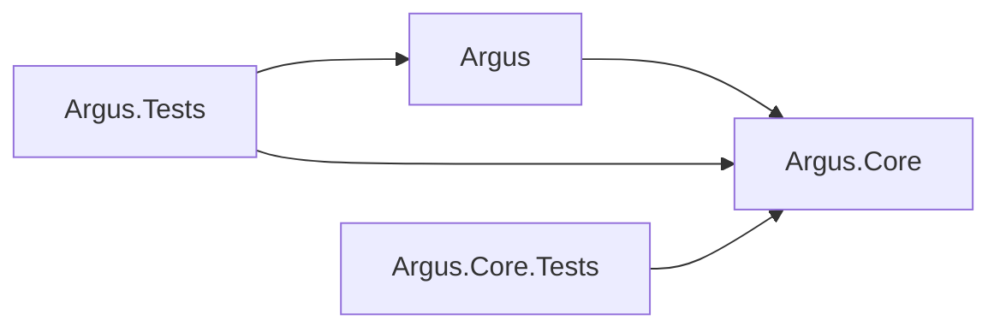

# Argus 基本設計書

## 1. 文書情報

- ステータス: 承認済み
- 対象: Avalonia 正式版 v0.2.0
- 対応要件: `Design/requirement.md`
- 最終更新日: 2026-08-29

本書は、Avalonia を唯一の正式 UI とする Windows 専用デスクトップアプリ Argus の設計を定義します。2026-08-12 に PoC から正式採用へ移行し、2026-08-29 にmacOS対応を当面の対象外としました。WinForms 版は廃止します。

v0.2.0 の現行実装に加え、MVP後に実装する自動監視、Windows OS標準ローカル通知、タスクバーバッジ、CSSセレクタ設定支援の拡張方針も定義します。これらは v0.2.0 の完了条件には含めません。

## 2. 設計目標

- View と更新チェック処理を分離し、MVVM で UI 状態を管理する
- HTML 取得、抽出、正規化、比較、差分生成、保存を独立してテストできるようにする
- Core を UI フレームワークと OS から独立させる
- エラー時に前回の正常な比較データを破壊しない
- Windowsで同じ機能と schema v1 JSON 契約を提供する

## 3. システム構成

```text
Argus.sln
├─ Argus                 Avalonia UI、ViewModel、UIサービス、起動処理
├─ Argus.Tests           ViewModel、コマンド、表示変換の自動テスト
├─ Argus.Core            モデル、取得、比較、保存、チェック調停
└─ Argus.Core.Tests      Coreの自動テスト
```

| プロジェクト | Target Framework | 役割 |
| --- | --- | --- |
| `Argus` | `net10.0` | Windows 向け正式 UI |
| `Argus.Tests` | `net10.0` | UI を生成しないプレゼンテーション層テスト |
| `Argus.Core` | `net10.0` | UI 非依存の業務処理と永続化 |
| `Argus.Core.Tests` | `net10.0` | Core の単体テスト |



依存ルール:

- `Argus.Core` は `Argus` または Avalonia を参照しない
- Avalonia 型を Core の公開 API、ドメインモデル、JSON 契約へ持ち込まない
- View はレイアウト、バインディング、ウィンドウ固有操作だけを担当する
- ViewModel は一覧状態、選択、入力検証、非同期コマンドを担当する
- OS 固有処理は UI プロジェクト内のサービス境界へ置く

## 4. コンポーネント

| コンポーネント | 責務 |
| --- | --- |
| `MainWindow` / `TargetEditWindow` | Avalonia View、バインディング、ウィンドウ操作 |
| `MainWindowViewModel` | 一覧、選択、集計、チェック・管理コマンド、テーマ状態 |
| `TargetEditViewModel` | 入力状態と Core の検証結果の表示 |
| `BrowserService` | HTTP / HTTPS URL を OS の既定ブラウザへ渡す |
| `ManualService` | 埋め込みマニュアルをバージョン別一時領域へ展開し、OSの既定ブラウザへ渡す |
| `DialogService` | 確認・エラーダイアログを ViewModel から分離する |
| `ContentDiffService` | 前回と今回の比較対象からUI非依存の差分結果を生成する |
| `CheckCoordinator` | 全件・選択チェック、並行実行、結果コミットの調停 |
| `WatchTargetManagementService` | 追加・編集・削除の検証と永続化 |
| `JsonTargetStore` | schema v1 JSON の安全な読込・保存 |
| `SettingsTransferService` | 監視対象の編集可能な設定をポータブルJSONへ変換、検証する |
| `SettingsFileDialogService` | 設定ファイルの保存先と読込元をユーザーに選択させるUI境界 |
| `AutomaticCheckScheduler` | 設定した間隔で有効な監視対象のチェックを起動し、アプリ終了・停止時のキャンセルを管理する |
| `MonitoringSettingsStore` | 自動監視設定、通知設定、未確認更新状態を targets.json と分離して保存する |
| `LocalNotificationService` | Windows の OS 標準ローカル通知へ更新検出を渡す |
| `ApplicationBadgeService` | Windows のタスクバーの未確認件数バッジを更新する |
| `CssSelectorPromptBuilder` | URL と監視したい箇所の説明から AI 相談用プロンプトを生成する |
| `CssSelectorPromptViewModel` | AI 相談用小窓の入力、表示、コピー状態を管理する |
| `IClipboardService` / `AvaloniaClipboardService` | UIから分離したクリップボードへのテキストコピーを提供する |

外部 DI コンテナーは追加せず、`App` の起動時に依存関係を手動構築します。`HttpClient` はアプリ単位で一つ生成し、終了時に破棄します。

## 5. データと互換性

- JSON は schema v1、UTF-8、camelCase、UTC日時を維持する。差分表示用の比較対象内容は `previousSnapshot.comparisonContent` として追加する任意項目とし、既存のschema v1 JSONを読み込める後方互換の拡張とする
- Windows の保存先は `%APPDATA%\Argus\targets.json` とし、WinForms v0.1.0 のデータを移行なしで読み込む
- 保存は同一ディレクトリの一時ファイルへ書き、成功後に置換する
- 取得、抽出、正規化、ハッシュ、保存のいずれかに失敗した場合は前回の正常データを上書きしない
- 既存の比較判定とschema v1の読み込み互換性を維持しつつ、差分表示に必要な比較内容と差分結果を表現する最小限のCoreモデル・公開APIを追加する
- 保存する比較対象内容は直近の正常チェック結果だけとし、チェック履歴は保持しない
- 運用中の `targets.json` と設定移行用のポータブルJSONは別契約として扱い、相互に直接読み替えない。ポータブルJSONはUnicode文字をJSON上でも可読なまま出力する
- CSSセレクタ設定支援は保存データや比較スナップショットを変更しない。URLと監視したい箇所の説明は小窓でプロンプトを生成するためだけに使用する

### 5.1 設定移行用ポータブルJSON

- 設定移行用JSONの形式識別子は `argus-settings`、形式バージョンは `1` とする
- JSONはUTF-8、BOMなし、camelCaseで保存する。名前やメモなどのUnicode文字はJSON上でも可読なまま出力する
- JSONは次の構造を持つ。`targets` の各要素には `name`、`url`、`mode`、`isEnabled`、`memo`、必要に応じて `cssSelector` を含める

```json
{
  "format": "argus-settings",
  "formatVersion": 1,
  "targets": [
    {
      "name": "サンプル",
      "url": "https://example.com/",
      "mode": "htmlText",
      "isEnabled": true,
      "memo": "",
      "cssSelector": null
    }
  ]
}
```

- `id`、`previousSnapshot`、チェック状態、チェック日時はエクスポートしない
- インポート時は形式識別子、形式バージョン、必須項目、URL、監視モード、CSSセレクタを全件検証する
- インポートした対象のIDはファイルから復元せず、新規に生成する
- インポートは現在の監視対象設定を置き換える方式とし、実行前に確認ダイアログを表示する
- チェック実行中はインポートを無効化し、インポート実行中は他の設定変更とチェック操作を無効化する
- エクスポート先に運用中のtargets.jsonと同一パスを指定できず、ポータブルJSONも一時ファイル経由で置換する
- 読込、検証、保存のいずれかに失敗した場合は、現在のメモリ状態と `targets.json` を変更しない
- インポートした対象は前回スナップショットを持たず、次回の正常チェックを初回取得として扱う

### 5.2 自動監視・通知データ（MVP後）

- 自動監視、通知、未確認更新の状態は、監視対象と前回スナップショットを保存する `targets.json` と別の `monitoring-settings.json` へ保存する
- `monitoring-settings.json` は UTF-8、camelCase、明示的な形式識別子とバージョンを持つ
- 保存する設定は、自動監視の有効状態、実行間隔、アプリ未起動時の監視設定、通知の有効状態、未確認更新の対象IDと比較用ハッシュとする
- 未確認更新は対象IDごとに1件へ集約し、同じ比較用ハッシュについて通知を繰り返さない。新しい比較用ハッシュを検出した場合は未確認状態を更新する
- 通知または一覧上の確認操作で対象を確認済みにした場合、未確認更新から対象IDを削除する
- 監視対象の削除、URL・監視モード・CSSセレクタの変更時は、該当する未確認更新を削除する
- `monitoring-settings.json` の読込または保存に失敗しても、`targets.json` の最後に正常に保存された監視対象と比較用データを変更しない
- 既存の `targets.json` schema v1 は維持し、`monitoring-settings.json` の形式変更は同ファイルのバージョンで管理する

## 6. チェック処理

1. ViewModel が対象 ID と `CancellationToken` を `CheckCoordinator` へ渡す
2. Coordinator が無効対象と同一対象の重複実行を除外する
3. `WebPageFetcher` が共有 `HttpClient` で HTML を取得する
4. 選択した比較方式で比較対象を抽出し、比較対象内容を保持したままSHA-256 ハッシュを生成する
5. 前回ハッシュと比較して初回取得、更新なし、更新ありを判定する
6. 更新ありで前回の比較対象内容が存在する場合は `ContentDiffService` で差分結果を生成する
7. 正常結果だけを Repository がハッシュと比較対象内容として保存し、確定後にイベントを通知する
8. ViewModel は必要な場合だけ Avalonia Dispatcher を介して一覧を更新する

前回の比較対象内容が存在しない既存JSONでは、ハッシュによる状態判定を継続します。ただし、その対象は比較対象内容が新たに保存されるまで詳細差分を表示できない状態として扱います。差分生成に失敗した場合はチェック結果をエラーとして扱い、前回の正常なスナップショットを維持します。

### 6.1 差分生成

- 差分の入力は、`ComparisonContentExtractor` が比較方式に応じて生成した文字列とする
- HTMLテキスト比較は正規化済み本文テキスト、HTML全体比較は未加工HTML、CSSセレクタ比較は一致要素の外側HTMLを文書順に連結した文字列を入力とする
- 差分結果は追加、削除、変更を表現できるUI非依存の値としてCoreで生成する
- 差分は入力文字列をLFで分割した行列へ変換し、Ordinal比較のLCSで一致行を求める。空行と末尾の空行を保持し、CRは行内容の一部として扱う
- 差分計算用LCS表のセル数は最大4,000,000とし、超過した場合は差分生成エラーとして前回の正常な比較用データを維持する
- LCSの一致区間に挟まる削除行と追加行は文書順に対応付け、両方がある組を変更、余った行を削除または追加として表現する
- 変更行は、前回値と今回値をUnicode文字要素へ分割し、各文字要素をOrdinal比較するインラインLCSで再比較する。一致区間は通常表示し、隣接する削除・追加区間は変更部分として前回・今回の双方へ対応付ける
- `ContentDiffEntry` は前回・今回それぞれの `ContentDiffSegment` 一覧を任意に保持し、セグメントを連結した値は元の行文字列と一致させる。追加・削除行は実値全体を変更セグメントとし、空側の表示用プレースホルダーはCoreの差分値へ含めない
- インラインLCSの表が上限を超えた場合は差分生成エラーとし、行単位LCSと同じく前回の正常な比較用データを維持する
- 差分の表示は前回・今回の比較対象を改変せず、変更セグメントを太字・下線・テーマ対応背景色で強調する。長い内容はダイアログ内で折り返しとスクロールにより確認できるようにする
- 差分は直近のチェック結果に対して画面表示するだけで、履歴として保存しない

### 6.2 自動監視と通知

1. `AutomaticCheckScheduler` が自動監視設定と実行間隔を読み込み、設定が有効な場合だけ次回の実行を予約する
2. スケジューラーは有効な監視対象を取得し、同一対象の自動チェックが実行中の場合は重複起動せず、`CheckCoordinator` へチェックを依頼する
3. `CheckCoordinator` は手動チェックと同じ取得、比較、保存、キャンセル、エラー時のデータ保護を実行する
4. 正常結果が確定した後、`Updated` かつ未確認更新の比較用ハッシュが異なる場合だけ、`MonitoringSettingsStore` の未確認状態を更新する
5. 未確認状態の更新後に `LocalNotificationService` へ対象名を渡し、`ApplicationBadgeService` へ未確認対象のユニーク件数を渡す。通知またはバッジ更新の失敗はチェック結果の保存を取り消さない
6. 通知の選択または一覧上の確認操作を受けた場合、対象を選択した状態で Argus を起動または前面表示し、未確認状態を削除してバッジ件数を再計算する
7. アプリが起動中はバックグラウンドのスケジューラーで実行し、アプリが起動していない時間帯も監視する設定では Windows のログイン時起動／タスクスケジューラーなど OS の起動機構から同じチェック処理を起動する

自動監視では初回取得、更新なし、エラーを通知対象とせず、更新ありだけを通知対象とします。比較対象の全文や秘密情報は OS 通知へ含めません。OS の通知権限が拒否されている場合も、一覧の状態と保存処理は通常どおり継続します。

HTTP 同時実行数はアプリ全体で最大4件とします。アプリ終了時は共通 `CancellationTokenSource` をキャンセルし、ViewModel は Core イベントの購読を解除します。

## 7. UI設計

- Avalonia 12.1.0 の Fluent Theme と公式 DataGrid を使用する
- メイン画面は監視対象、URL、監視モード、有効状態、チェック状態、最終チェック日時を表示する
- 複数選択、全件チェック、選択項目チェック、ブラウザ起動、追加、編集、削除、正式マニュアル表示を提供する
- 更新ありの対象を選択した場合に「差分を表示」操作を提供し、前回・今回の比較対象の追加、削除、変更をダイアログで表示する
- 更新あり以外の対象では差分表示操作を無効にするか、差分を表示できない理由を示す
- DataGrid は列幅変更、自動調整、水平・垂直スクロールを提供する
- 編集画面は名前、URL、監視モード、CSSセレクタ、有効状態、メモを扱う
- メイン画面は「設定をインポート」「設定をエクスポート」の操作を提供する。エクスポートは保存先選択、インポートは読込元選択と置換確認を経て実行する
- ライトテーマを既定とし、画面上でライト／ダークを切り替えられる
- 状態、フォーカス、無効、エラーを色だけに依存せず文字でも識別できるようにする
- `assets/argus-banner.png` をアルゴスくんを認識できる薄さで、一覧の操作を妨げない背景として使用する
- 全ウィンドウと各OSの成果物で同じ Argus アイコンを使用する
- バージョンは `v0.2.0`、Debug構成だけ `DEBUG` を表示する
- ヘッダー右側にアイコンと文字ラベルを持つ「マニュアル」ボタンを置き、選択状態や起動データエラーに依存せず利用可能にする
- ヘッダー右側のマニュアルボタンとテーマ切替には共通の `headerAction` スタイルを適用し、通常時は濃紺背景と白文字、ホバー時はアクセント背景と白文字で統一する
- MVP後は、自動監視の有効状態、実行間隔、アプリ未起動時の監視、通知の有効状態を設定できる画面または設定領域を追加する
- MVP後は、更新通知から対象を確認できる操作と、一覧上で未確認更新を確認済みにする操作を提供する
- MVP後は、CSSセレクタ比較の入力欄に AI 相談ボタンを置き、URLと監視したい箇所の説明から生成したプロンプトを小窓へ表示する
- AI 相談小窓は、生成プロンプトの読み取り専用表示、クリップボードへのコピー、コピー結果またはエラーの表示を提供する。外部 AI の起動、AI API 通信、ページ HTML の取得は行わない

## 8. OS固有処理

- `Process.Start` と `UseShellExecute=true` により OS の既定ブラウザを利用する
- マニュアル資産はアセンブリへ埋め込み、実行時にOSの一時領域にある `Argus/Manual/v0.2.0` へ固定名で展開する
- 展開済み資産はブラウザ表示を継続できるようアプリ終了時に削除せず、旧バージョンの自動削除は行わない
- Windowsの例外をユーザー向けメッセージへ変換する
- Windows のローカル通知は Windows App SDK の `AppNotificationManager` を候補とし、タスクバーの数値バッジは `BadgeNotificationManager` を候補とする。自己完結型 single-file 配布で必要となるアプリ識別と通知登録を別途検証する
- OS 固有の通知・バッジ実装は `Argus` 側のサービスへ閉じ込め、`Argus.Core` の公開 API とドメインモデルへ持ち込まない
- macOS、Linux、Windows arm64 は v0.2.0 の対象外とする

## 9. 配布設計

### Windows

- Runtime Identifier: `win-x64`
- 成果物: `artifacts/Argus-win-x64-single/Argus.exe`
- `SelfContained=true`、`PublishSingleFile=true`
- `PublishTrimmed=false`、`PublishReadyToRun=false`
- `Manual/index.html`、`Manual/main.png`、`Manual/entry.png` を埋め込み、外部ファイルを追加しない

## 10. テスト設計

- `Argus.Core.Tests` は実Webサイトへ接続せず、初回取得、更新なし、更新あり、通信エラー、データ保護、JSON読込、入力検証、並行実行を検証する
- `Argus.Core.Tests` は比較方式ごとの比較対象保持、差分生成、既存JSONの比較内容欠落時の互換動作、差分生成エラー時のデータ保護を検証する
- `Argus.Tests` は ViewModel、コマンド、表示変換、UIサービス境界を View なしで検証する
- `Argus.Tests` は更新ありの行だけで差分表示操作が利用でき、差分ダイアログへ追加・削除・変更が渡されることを検証する
- マニュアルコマンドの常時利用、成功・失敗結果と、HTML・画像の埋め込みリソースを自動テストする
- Windowsで restore、Debug / Release build、全自動テストを実行する
- Windowsで CRUD、全件／選択チェック、ブラウザ起動、再起動後の永続化、ライト／ダーク、キーボード、ダイアログ、アイコン、バージョンを手動確認する
- T-037では、Windowsで設定のエクスポート、正常なインポート、形式エラー時の既存設定保持、インポート対象が初回取得になることを手動確認する
- MVP後のT-038では、スケジューラーをテスト用時計とスタブへ差し替え、自動監視の有効対象、間隔、重複抑止、停止・キャンセル、エラー時のデータ保護を自動テストする
- MVP後のT-039では、通知とバッジをスタブへ差し替え、更新ありだけの通知、同一ハッシュの重複通知抑止、未確認件数、確認済みへの遷移、通知失敗時の結果保持を自動テストする
- MVP後のT-040では、URLと説明からのプロンプト生成、未入力時の案内、コピー成功・失敗、CSSモード以外での操作不可を自動テストし、Windowsで小窓・クリップボード・テーマ表示を手動確認する
- Windowsでは、実機で OS 標準通知、通知権限拒否、通知選択による対象表示、タスクバー バッジ、アプリ再起動後の未確認件数復元を手動確認する
- Windows の single-file を発行先とは別の場所から起動する

## 11. 正式採用決定

PoCでは Core の変更なしに Avalonia UI を実装でき、Windows上で警告なしビルド、Core 67件・WinForms 15件・Avalonia 14件の計96件のテスト、起動、単一EXE発行を確認しました。Core再利用性を「高」、導入難易度を「中」と評価し、2026-08-12にAvaloniaを正式採用しました。

正式採用により、WinFormsプロジェクトとテストを削除し、Avaloniaプロジェクトを `Argus`、テストを `Argus.Tests` へ改名しました。2026-08-29の方針変更により、macOS向け発行・実機確認は現行のv0.2.0リリース受け入れ条件から除外します。
