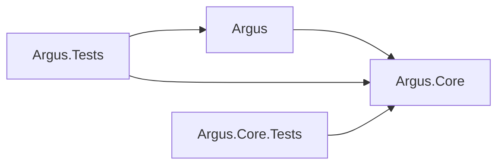

# Argus 基本設計書

## 1. 文書情報

- ステータス: 承認済み
- 対象: Avalonia 正式版 v0.2.0
- 対応要件: `Design/requirement.md`
- 最終更新日: 2026-08-12

本書は、Avalonia を唯一の正式 UI とする Windows / macOS デスクトップアプリ Argus の設計を定義します。2026-08-12 に PoC から正式採用へ移行し、WinForms 版は廃止します。

## 2. 設計目標

- View と更新チェック処理を分離し、MVVM で UI 状態を管理する
- HTML 取得、抽出、正規化、比較、保存を独立してテストできるようにする
- Core を UI フレームワークと OS から独立させる
- エラー時に前回の正常な比較データを破壊しない
- Windows と macOS で同じ機能と schema v1 JSON 契約を提供する

## 3. システム構成

```text
Argus.sln
├─ Argus                 Avalonia UI、ViewModel、UIサービス、起動処理
├─ Argus.Tests           ViewModel、コマンド、表示変換の自動テスト
├─ Argus.Core            モデル、取得、比較、保存、チェック調停
└─ Argus.Core.Tests      Coreの自動テスト
```

| プロジェクト | Target Framework | 役割 |
| --- | --- | --- |
| `Argus` | `net8.0` | Windows / macOS 向け正式 UI |
| `Argus.Tests` | `net8.0` | UI を生成しないプレゼンテーション層テスト |
| `Argus.Core` | `net8.0` | UI 非依存の業務処理と永続化 |
| `Argus.Core.Tests` | `net8.0` | Core の単体テスト |



依存ルール:

- `Argus.Core` は `Argus` または Avalonia を参照しない
- Avalonia 型を Core の公開 API、ドメインモデル、JSON 契約へ持ち込まない
- View はレイアウト、バインディング、ウィンドウ固有操作だけを担当する
- ViewModel は一覧状態、選択、入力検証、非同期コマンドを担当する
- OS 固有処理は UI プロジェクト内のサービス境界へ置く

## 4. コンポーネント

| コンポーネント | 責務 |
| --- | --- |
| `MainWindow` / `TargetEditWindow` | Avalonia View、バインディング、ウィンドウ操作 |
| `MainWindowViewModel` | 一覧、選択、集計、チェック・管理コマンド、テーマ状態 |
| `TargetEditViewModel` | 入力状態と Core の検証結果の表示 |
| `BrowserService` | HTTP / HTTPS URL を OS の既定ブラウザへ渡す |
| `ManualService` | 埋め込みマニュアルをバージョン別一時領域へ展開し、OSの既定ブラウザへ渡す |
| `DialogService` | 確認・エラーダイアログを ViewModel から分離する |
| `CheckCoordinator` | 全件・選択チェック、並行実行、結果コミットの調停 |
| `WatchTargetManagementService` | 追加・編集・削除の検証と永続化 |
| `JsonTargetStore` | schema v1 JSON の安全な読込・保存 |

外部 DI コンテナーは追加せず、`App` の起動時に依存関係を手動構築します。`HttpClient` はアプリ単位で一つ生成し、終了時に破棄します。

## 5. データと互換性

- JSON は schema v1、UTF-8、camelCase、UTC日時を維持する
- Windows の保存先は `%APPDATA%\Argus\targets.json` とし、WinForms v0.1.0 のデータを移行なしで読み込む
- macOS の保存先は `~/Library/Application Support/Argus/targets.json` とする
- 保存は同一ディレクトリの一時ファイルへ書き、成功後に置換する
- 取得、抽出、正規化、ハッシュ、保存のいずれかに失敗した場合は前回の正常データを上書きしない
- Core の公開 API、モデル、schema v1 は v0.2.0 で変更しない

## 6. チェック処理

1. ViewModel が対象 ID と `CancellationToken` を `CheckCoordinator` へ渡す
2. Coordinator が無効対象と同一対象の重複実行を除外する
3. `WebPageFetcher` が共有 `HttpClient` で HTML を取得する
4. 選択した比較方式で比較対象を抽出し、SHA-256 ハッシュを生成する
5. 前回ハッシュと比較して初回取得、更新なし、更新ありを判定する
6. 正常結果だけを Repository が保存し、確定後にイベントを通知する
7. ViewModel は必要な場合だけ Avalonia Dispatcher を介して一覧を更新する

HTTP 同時実行数はアプリ全体で最大4件とします。アプリ終了時は共通 `CancellationTokenSource` をキャンセルし、ViewModel は Core イベントの購読を解除します。

## 7. UI設計

- Avalonia 12.1.0 の Fluent Theme と公式 DataGrid を使用する
- メイン画面は監視対象、URL、監視モード、有効状態、チェック状態、最終チェック日時を表示する
- 複数選択、全件チェック、選択項目チェック、ブラウザ起動、追加、編集、削除、正式マニュアル表示を提供する
- DataGrid は列幅変更、自動調整、水平・垂直スクロールを提供する
- 編集画面は名前、URL、監視モード、CSSセレクタ、有効状態、メモを扱う
- ライトテーマを既定とし、画面上でライト／ダークを切り替えられる
- 状態、フォーカス、無効、エラーを色だけに依存せず文字でも識別できるようにする
- `assets/argus-banner.png` を一覧の操作を妨げない薄い背景として使用する
- 全ウィンドウと各OSの成果物で同じ Argus アイコンを使用する
- バージョンは `v0.2.0`、Debug構成だけ `DEBUG` を表示する
- ヘッダー右側にアイコンと文字ラベルを持つ「マニュアル」ボタンを置き、選択状態や起動データエラーに依存せず利用可能にする
- ヘッダー右側のマニュアルボタンとテーマ切替には共通の `headerAction` スタイルを適用し、通常時は濃紺背景と白文字、ホバー時はアクセント背景と白文字で統一する

## 8. OS固有処理

- `Process.Start` と `UseShellExecute=true` により OS の既定ブラウザを利用する
- マニュアル資産はアセンブリへ埋め込み、実行時にOSの一時領域にある `Argus/Manual/v0.2.0` へ固定名で展開する
- 展開済み資産はブラウザ表示を継続できるようアプリ終了時に削除せず、旧バージョンの自動削除は行わない
- Windows と macOS の例外をプラットフォーム非依存のユーザー向けメッセージへ変換する
- macOS用 app bundle は `Info.plist`、`Contents/MacOS`、`Contents/Resources` を持つ
- Linux、Intel Mac、Windows arm64 は v0.2.0 の対象外とする

## 9. 配布設計

### Windows

- Runtime Identifier: `win-x64`
- 成果物: `artifacts/Argus-win-x64-single/Argus.exe`
- `SelfContained=true`、`PublishSingleFile=true`
- `PublishTrimmed=false`、`PublishReadyToRun=false`
- `Manual/index.html`、`Manual/main.png`、`Manual/entry.png` を埋め込み、外部ファイルを追加しない

### macOS

- 対象: macOS 14以降、Apple Silicon
- Runtime Identifier: `osx-arm64`
- 成果物: `artifacts/Argus-macos-arm64/Argus.app`
- 自己完結型として.NETランタイムを同梱する
- HTMLマニュアルと画像を実行アセンブリへ埋め込む
- Apple Developer署名、公証、インストーラー、自動更新は後続タスクとする

## 10. テスト設計

- `Argus.Core.Tests` は実Webサイトへ接続せず、初回取得、更新なし、更新あり、通信エラー、データ保護、JSON読込、入力検証、並行実行を検証する
- `Argus.Tests` は ViewModel、コマンド、表示変換、UIサービス境界を View なしで検証する
- マニュアルコマンドの常時利用、成功・失敗結果と、HTML・画像の埋め込みリソースを自動テストする
- Windows と macOS の双方で restore、Debug / Release build、全自動テストを実行する
- 両OSで CRUD、全件／選択チェック、ブラウザ起動、再起動後の永続化、ライト／ダーク、キーボード、ダイアログ、アイコン、バージョンを手動確認する
- Windows の single-file と macOS の app bundle を発行先とは別の場所から起動する

## 11. 正式採用決定

PoCでは Core の変更なしに Avalonia UI を実装でき、Windows上で警告なしビルド、Core 67件・WinForms 15件・Avalonia 14件の計96件のテスト、起動、単一EXE発行を確認しました。Core再利用性を「高」、導入難易度を「中」と評価し、2026-08-12にAvaloniaを正式採用しました。

正式採用により、WinFormsプロジェクトとテストを削除し、Avaloniaプロジェクトを `Argus`、テストを `Argus.Tests` へ改名します。未実施だったmacOS実機確認と全機能手動確認は、採用判断の前提ではなくv0.2.0リリース受け入れ条件として `Design/tasks.md` で追跡します。
