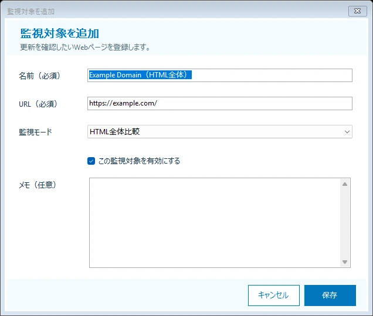

# Argus ユーザーマニュアル

## 1. Argus について

Argus は、登録した Web ページが前回の確認時から更新されたかを、まとめて確認するための Windows デスクトップアプリです。

ブログ、お知らせ、配布ページ、更新履歴など、定期的に確認したい公開 Web ページを登録しておくと、ボタン操作で更新の有無を確認できます。更新チェックは自動では行われません。確認したいときに Argus を起動して、手動でチェックしてください。

## 2. 動作環境

- Windows 10 または Windows 11
- Windows x64
- インターネット接続
- HTTP または HTTPS で公開されている Web ページ

## 3. 起動する

配布された `Argus.WinForms.exe` をダブルクリックします。起動すると、登録済みの監視対象がメイン画面に表示されます。

初回起動時は監視対象が登録されていないため、一覧は空です。「追加」ボタンから監視対象を登録してください。

## 4. メイン画面


### 4.1 画面上部の表示

- **監視対象**: 登録されている監視対象の件数
- **チェック中**: 現在チェックを実行している監視対象の件数
- **全件チェック**: 有効な監視対象をすべてチェック
- **選択をチェック**: 一覧で選択した有効な監視対象だけをチェック
- **ブラウザで開く**: 選択した1件の URL を Windows の既定ブラウザで表示
- **追加**: 新しい監視対象を登録
- **編集**: 選択した1件の登録内容を変更
- **削除**: 選択した1件を削除

「編集」と「削除」は、監視対象を1件だけ選択したときに利用できます。チェック中の監視対象は、チェックが完了するまで編集または削除できません。

### 4.2 監視対象一覧

一覧には次の項目が表示されます。

| 項目 | 説明 |
| --- | --- |
| 有効 | 「はい」の監視対象はチェック対象になります。「いいえ」の監視対象は全件チェックおよび選択チェックの対象になりません |
| 名前 | 登録時に指定した監視対象の名前 |
| URL | 更新を確認する Web ページの URL |
| 状態 | 最新のチェック結果。チェック中は実行中であることも併記されます |
| 最終チェック | 最後にチェックが完了した日時。未実行の場合は「—」 |
| エラー | チェックに失敗した理由。エラーがない場合は「—」 |

行をクリックすると監視対象を選択できます。`Ctrl` キーを押しながら複数の行をクリックすると、複数選択できます。現在の選択件数は一覧右上に表示されます。

画面下部には、操作結果やエラーの概要、コピーライト、バージョンが表示されます。開発用の Debug ビルドでは `DEBUG` も表示されます。

## 5. 監視対象を登録する

1. メイン画面の「追加」ボタンをクリックします。
2. 「監視対象を追加」画面で各項目を入力します。
3. 「保存」ボタンをクリックします。
4. 登録した監視対象がメイン画面の一覧に追加されたことを確認します。



### 5.1 入力項目

| 項目 | 必須 | 説明 |
| --- | --- | --- |
| 名前 | はい | 一覧で監視対象を識別するための名前 |
| URL | はい | 更新を確認するページの絶対 URL。`http://` または `https://` で始まる URL を入力します |
| 監視モード | はい | 「HTMLテキスト比較」「HTML全体比較」「CSSセレクタ比較」から選択します |
| CSSセレクタ | 条件付き | CSSセレクタ比較を選んだ場合に、比較したい要素のセレクタを入力します |
| この監視対象を有効にする | いいえ | オンにするとチェック対象になります。新規登録時はオンです |
| メモ | いいえ | 監視対象についての補足を自由に記録できます |

名前が空の場合や URL の形式が正しくない場合は、該当する入力欄にエラーが表示され、保存されません。内容を修正してから、もう一度「保存」をクリックしてください。

「キャンセル」をクリックすると、入力内容を保存せずにメイン画面へ戻ります。

## 6. 更新をチェックする

### 6.1 すべての監視対象をチェックする

メイン画面の「全件チェック」ボタンをクリックします。有効になっている監視対象のチェックが開始されます。無効な監視対象はチェックされません。

### 6.2 選択した監視対象をチェックする

1. 一覧でチェックしたい監視対象を選択します。
2. 必要に応じて、`Ctrl` キーを押しながら複数の行を選択します。
3. 「選択をチェック」ボタンをクリックします。

選択した行のうち、有効な監視対象だけがチェックされます。

### 6.3 チェック中の操作

チェックは画面を操作できる状態のまま実行されます。チェック中でも、別の監視対象のチェックやブラウザ表示を開始できます。同じ監視対象をもう一度チェックすることもできます。

同じ監視対象を重複してチェックした場合、最後に完了したチェック結果が一覧に表示されます。状態欄の「チェック中 ×2」のような表示は、その監視対象に対して複数のチェックが実行中であることを表します。

## 7. チェック結果を確認する

| 状態 | 意味 |
| --- | --- |
| 未確認 | Argus を起動してから、まだチェックしていません |
| 初回取得 | 比較に使う前回データがなかったため、今回取得した内容を基準として保存しました |
| 更新なし | 今回の内容と前回の正常なチェック内容が同じです |
| 更新あり | 今回の内容が前回の正常なチェック内容から変わっています |
| エラー | Web ページの取得または比較に失敗しました。理由は「エラー」列に表示されます |

HTMLテキスト比較では、HTML 内の表示テキストを比較します。`script`、`style`、HTML コメント、空白や改行だけの違いは比較対象から除外されます。HTML全体比較では取得したHTML文字列全体を比較します。CSSセレクタ比較では一致する要素だけを比較し、セレクタが不正または一致要素がない場合はエラーになります。

正常に完了したチェック結果は自動的に保存され、次回の比較に使われます。チェックがエラーになった場合、前回の正常な比較データは上書きされません。通信状態や URL を確認したあと、再度チェックしてください。

## 8. Web ページをブラウザで開く

1. 一覧から監視対象を1件選択します。
2. 「ブラウザで開く」ボタンをクリックします。
3. 登録されている URL が Windows の既定ブラウザで開きます。

ブラウザで開けない場合は、登録 URL と Windows の既定ブラウザの設定を確認してください。

## 9. 監視対象を編集する

1. 一覧から編集する監視対象を1件選択します。
2. 「編集」ボタンをクリックします。
3. 内容を変更し、「保存」ボタンをクリックします。

URL を変更すると、それまで保存されていた比較用データは破棄されます。変更後の URL を次に正常にチェックしたときは「初回取得」になります。

一時的にチェック対象から外したい場合は、「この監視対象を有効にする」をオフにして保存してください。登録内容を削除せず、全件チェックと選択チェックの対象から除外できます。

## 10. 監視対象を削除する

1. 一覧から削除する監視対象を1件選択します。
2. 「削除」ボタンをクリックします。
3. 確認画面の内容を確認し、「はい」をクリックします。

監視対象を削除すると、その監視対象に保存されていた前回のチェックデータも削除されます。この操作は元に戻せません。削除しない場合は「いいえ」をクリックしてください。

## 11. データの保存

監視対象の登録内容と前回の正常なチェック結果は、次の JSON ファイルに自動保存されます。

```text
%APPDATA%\Argus\targets.json
```

通常はこのファイルを手動で編集する必要はありません。追加、編集、削除、正常なチェックの完了時に Argus が更新します。

ファイルが空、不正、または未対応の形式で、起動時に読み込めなかった場合はエラーが表示されます。データを保護するため、チェック、監視対象の管理、ブラウザ表示などの主要な操作は無効になり、既存ファイルは上書きされません。

## 12. 利用上の注意

- Argus は手動チェック専用です。自動監視、常駐監視、スケジュール実行、通知には対応していません。
- ログイン、Cookie、CAPTCHA が必要なページには対応していません。
- JavaScript の実行後に内容が生成される SPA などは正しく比較できない場合があります。
- 差分箇所やチェック履歴は表示しません。「更新あり」の場合は、ブラウザでページを開いて内容を確認してください。
- ページ全体の表示テキストを比較するため、日付、閲覧数、広告などが変化するページでは、本文に変更がなくても「更新あり」になる場合があります。
- 1回の取得は30秒でタイムアウトします。多数の監視対象をチェックする場合、同時に取得するのは最大4件で、残りは順番に処理されます。
- アプリを終了すると、実行中および待機中のチェックはキャンセルされます。

## 13. 困ったときは

### チェックボタンを押せない

「全件チェック」は、有効な監視対象が1件もない場合は利用できません。「選択をチェック」は、有効な監視対象が選択されていない場合は利用できません。監視対象の登録内容と選択状態を確認してください。

### 編集または削除ボタンを押せない

監視対象を1件だけ選択してください。選択した監視対象がチェック中の場合は、チェックの完了後に操作してください。

### 「エラー」と表示される

「エラー」列と画面下部のメッセージを確認してください。インターネット接続、登録 URL、対象ページの公開状態を確認してから、再度チェックしてください。エラーが発生しても、前回の正常な比較データは保持されます。

### 毎回「更新あり」になる

ページ内の日付、アクセス数、広告など、閲覧のたびに変わる表示テキストが含まれている可能性があります。現在のバージョンでは、ページ内の一部分だけを指定して比較することはできません。
