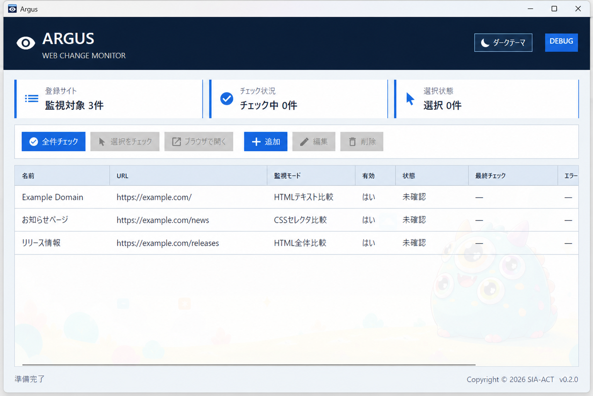

# Argus

[](#動作環境)
[](#動作環境)
[](Argus/Argus.csproj)
[](LICENSE)

登録した Web ページの変化を、必要なときにまとめて確認できる Windows 専用 Avalonia デスクトップアプリです。v0.2.0では自動監視ではなく、ユーザーがボタンを押したときだけチェックします。

## 特長

- 登録した全ページ、または選択したページをまとめて手動チェック
- HTMLテキスト、HTML全体、CSSセレクタの3種類の比較方式
- 初回取得、更新なし、更新あり、エラーを一覧表示
- 更新ありの対象について、前回と今回の比較対象の差分を表示し、変更行の文字列内もハイライト
- 監視対象の追加、編集、削除、有効／無効切替
- 監視対象設定のインポート、エクスポート
- 選択したページをOSの既定ブラウザで表示
- 通信や解析に失敗しても前回の正常な比較データを保護
- ライト／ダークテーマを切替可能



詳しい操作は[ユーザーマニュアル](Manual/index.html)を参照してください。アプリ起動後は、画面右上の「マニュアル」ボタンから同じオフライン版を開けます。

## 動作環境

| 項目 | 要件 |
| --- | --- |
| Windows | Windows 10 / 11 x64 |
| SDK | ソースから実行する場合は.NET 10 SDK |
| UI | Avalonia 12.1.0 |

macOS、Linux、Windows arm64、署名・公証、インストーラー、自動更新にはまだ対応していません。

## はじめ方

```powershell
git clone <repository-url>
cd argus-project
dotnet restore
dotnet build Argus.sln
dotnet run --project Argus
```

すべてのテストは次のコマンドで実行できます。

```powershell
dotnet test Argus.sln
```

## 基本的な使い方

1. 「追加」から名前とHTTP/HTTPS URLを登録します
2. 必要に応じて比較方式とCSSセレクタを設定します
3. 必要に応じて「設定をエクスポート」で監視対象の設定をJSONへ保存します
4. 別の環境では「設定をインポート」でJSONを選び、現在の設定を置き換えます
5. 「全件チェック」または「選択をチェック」を実行します
6. 一覧の更新状態を確認します
7. 「更新あり」の対象を1件選び、「差分を表示」で追加・削除・変更を確認します
8. 必要に応じて「ブラウザで開く」でページを確認します

## データとプライバシー

監視対象と正常終了した比較結果は、差分表示用の直近の比較対象内容を含めてローカルのschema v1 JSONへ保存されます。チェック履歴は保存されません。

```text
Windows: %APPDATA%\Argus\targets.json
```

Argusが外部データベースへ情報を送る機能はありません。チェック時には登録したURLへHTTP/HTTPSでアクセスします。エラー時は前回の正常なデータを上書きしません。

「設定をエクスポート」で作成するポータブルJSONには、名前、URL、監視モード、CSSセレクタ、有効状態、メモだけが含まれます。前回の比較データやチェック日時は含まれず、インポートした対象は次回の正常チェックで「初回取得」になります。

## 現在の制約

- 自動チェック、常駐監視、スケジュール実行、通知には対応していません
- ログイン、Cookie、CAPTCHAが必要なページには対応していません
- JavaScript実行後に内容を生成するSPAは解析できません
- チェック履歴は表示しません
- 差分対象が大きすぎる場合は、差分を生成せず前回の正常な比較データを保持します
- 比較内容が保存されていない既存schema v1データでは、最初の更新について差分を表示できません。正常チェック後の次回以降の更新から表示できます

## MVP後の計画

MVP後は、CSSセレクタ設定時のAI相談用プロンプト支援、設定した間隔での自動監視、更新あり時の Windows OS 標準ローカル通知、未確認件数のタスクバーアイコンバッジを追加する予定です。AIサービスへの自動送信や、LINE、Slack、メールなど外部サービスへの通知は行いません。

## プロジェクト構成

```text
Argus/                 Avalonia UI、ViewModel、UIサービス
Argus.Tests/           ViewModelと表示変換のテスト
Argus.Core/            取得、抽出、比較、保存、チェック調停
Argus.Core.Tests/      Coreのテスト
Design/                要件、設計、タスク、発行確認手順
Manual/                HTMLユーザーマニュアルと画像
assets/                バナーとアプリアイコン
```

CoreはAvaloniaに依存しません。開発では仕様駆動開発（SDD）とテスト駆動開発（TDD）を採用しています。

## コントリビューション

変更前に次の順で関連文書を確認してください。

1. [要件定義](Design/requirement.md)
2. [基本設計](Design/design.md)
3. [実装タスク](Design/tasks.md)
4. [プロジェクト構想](Design/project-overview.md)

詳細な作業規則は[AGENTS.md](AGENTS.md)にあります。

## ライセンス

Argusは[MIT License](LICENSE)のもとで公開しています。

Copyright © 2026 SIA-ACT
