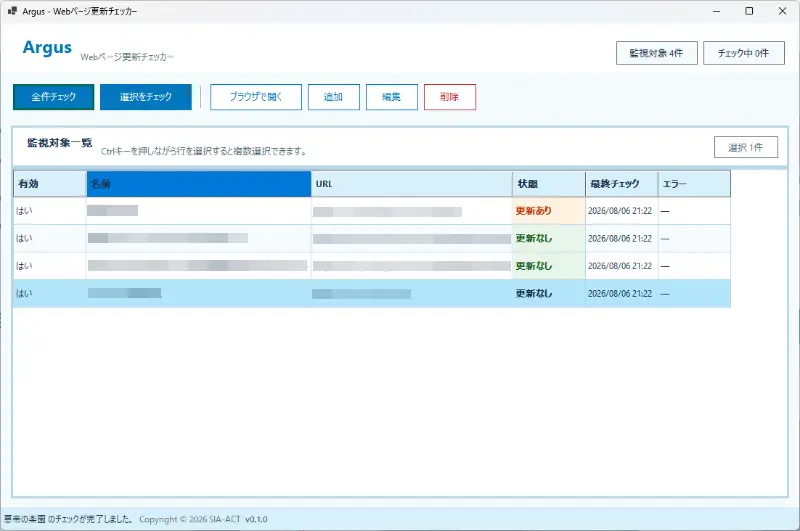

# Argus

[](#動作環境)
[](#動作環境)
[](Argus.WinForms/Argus.WinForms.csproj)
[](LICENSE)

登録した Web ページの変化を、必要なときにまとめて確認できる Windows デスクトップアプリです。

ブログ、お知らせ、配布ページ、更新履歴などを一つずつブラウザで開く手間を減らします。アプリ名は、数多くの眼で見張るギリシャ神話の巨人「アルゴス」に由来します。

> [!NOTE]
> Argus は自動監視サービスではありません。ユーザーがボタンを押したタイミングでだけチェックする、ローカルファーストなアプリです。

## 特長

- 登録した全ページ、または選択したページをまとめて手動チェック
- 用途に合わせて選べる3種類の比較方式
- 「初回取得」「更新なし」「更新あり」「エラー」を見やすく一覧表示
- 監視対象の追加、編集、削除、有効・無効の切り替え
- 選択したページを Windows の既定ブラウザで表示
- 監視対象と比較データをローカルの JSON ファイルへ保存
- 通信や解析に失敗しても、前回の正常な比較データを保護



詳しい画面操作や設定例は [ユーザーマニュアル](Manual/index.html) を参照してください。

## 比較方式

| 方式 | 比較する内容 | 向いているページ |
| --- | --- | --- |
| HTML テキスト比較 | `script`、`style`、コメントを除き、空白を正規化した本文テキスト | ブログ、記事、お知らせなどの一般的なページ |
| HTML 全体比較 | 取得した HTML 全体 | HTML の小さな変化も検知したいページ |
| CSS セレクタ比較 | CSS セレクタに一致した要素 | 更新履歴や一覧など、特定の範囲だけを見たいページ |

通常は誤検知を抑えやすい「HTML テキスト比較」から始め、必要に応じて比較範囲を変更するのがおすすめです。

## 動作環境

| 項目 | 要件 |
| --- | --- |
| OS | Windows 10 / Windows 11 |
| SDK | .NET 8 SDK |
| UI | Windows Forms |

現在、インストーラーやビルド済み実行ファイルは配布していません。利用するにはソースコードからビルドしてください。

## はじめ方

### 1. リポジトリを取得

```powershell
git clone <repository-url>
cd argus-project
```

`<repository-url>` は、このリポジトリの Clone URL に置き換えてください。

### 2. ビルド

```powershell
dotnet restore
dotnet build Argus.sln
```

### 3. 起動

```powershell
dotnet run --project Argus.WinForms
```

## 基本的な使い方

1. 「追加」から、名前と HTTP/HTTPS URL を登録します。
2. 必要に応じて比較方式と CSS セレクタを設定します。
3. 「全件チェック」または「選択をチェック」を実行します。
4. 一覧に表示された更新状態を確認します。
5. ページを確認するときは、対象を選択して「ブラウザで開く」を押します。

Ctrl キーを押しながら行を選択すると、複数の監視対象を選択できます。初回の正常なチェックは比較基準を保存するため「初回取得」と表示され、2回目以降に変化の有無を判定します。

## データとプライバシー

監視対象と前回の正常なチェック結果は、次のローカルファイルに保存されます。

```text
%APPDATA%\Argus\targets.json
```

Argus に外部データベースへ情報を送信する機能はありません。チェック時には登録された URL へ HTTP/HTTPS でアクセスします。保存に失敗した場合やチェック中にエラーが発生した場合は、既存の正常なデータを上書きしません。

## 現在の制約

- 自動チェック、常駐監視、スケジュール実行、通知には対応していません
- ログイン、Cookie、CAPTCHA が必要なページには対応していません
- JavaScript の実行後に内容が生成される SPA は解析できません
- ブラウザレンダリングには対応していません
- 差分内容やチェック履歴は表示しません
- HTML 全体比較では、広告、日時、ランダム ID など意味のない変化も検知する場合があります

## プロジェクト構成

```text
Argus.Core/           更新チェック、比較、保存などのコアロジック
Argus.WinForms/       Windows Forms UI
Argus.Core.Tests/     コアロジックのテスト
Argus.WinForms.Tests/ UI・プレゼンテーション層のテスト
Design/               要件、設計、タスク、プロジェクト構想
Manual/               HTML ユーザーマニュアルとスクリーンショット
UI/                   WinForms UI の設計モック
```

UI と更新チェック処理を分離し、Core 層を WinForms に依存させない構成です。開発では仕様駆動開発（SDD）とテスト駆動開発（TDD）を採用しています。

## 開発とテスト

すべてのテストを実行するには、リポジトリのルートで次を実行します。

```powershell
dotnet test Argus.sln
```

仕様や実装を変更する場合は、次の順で関連文書を確認してください。

1. [要件定義](Design/requirement.md)
2. [設計](Design/design.md)
3. [実装タスク](Design/tasks.md)
4. [プロジェクト構想](Design/project-overview.md)

開発ルールの詳細は [AGENTS.md](AGENTS.md) にあります。

## コントリビューション

Issue による不具合報告や改善提案、Pull Request を歓迎します。

- 既存の要件・設計・タスクとの整合を確認してください
- 振る舞いを変更する場合は、仕様文書とテストを先に更新してください
- 1つの変更では1つの目的に集中し、無関係な変更を混在させないでください
- `dotnet build Argus.sln` と `dotnet test Argus.sln` が成功することを確認してください

## ロードマップ

初期 MVP 以降の候補には、次の機能があります。実装前に要件・設計・タスクを更新します。

- 小説サイト向けの最新エピソード比較
- 更新された最新話を直接開く機能
- 差分表示とチェック履歴
- UI の継続的な改善

## ライセンス

Argus は [MIT License](LICENSE) のもとで公開しています。

Copyright © 2026 SIA-ACT
